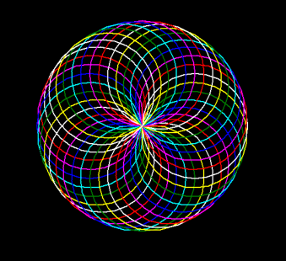
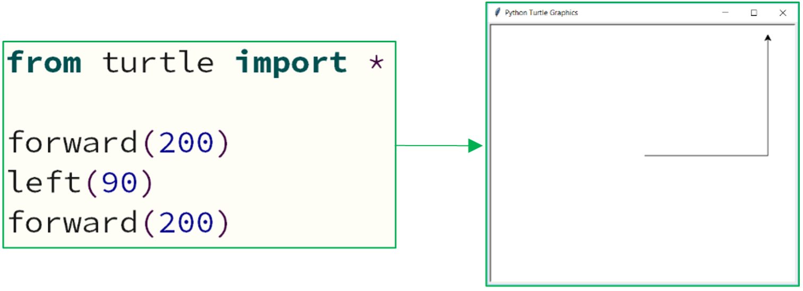
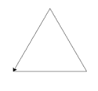
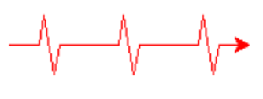
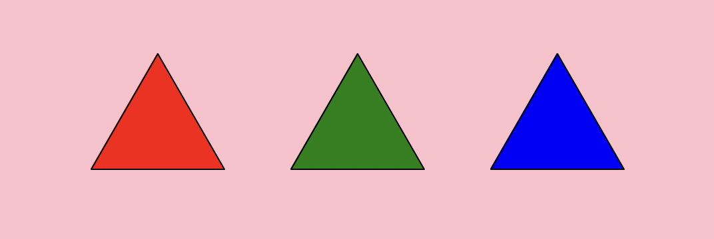
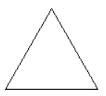
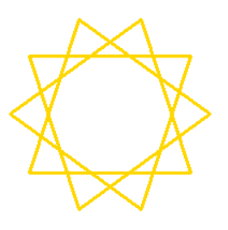

---
hide:
  - toc
---
# Turtle Programming

This term, you will start developing your knowledge of Python code to learn how to draw graphics on to the computer screen. 

To do this, you will be using the Turtle module – which is simply an extra part of Python. 

A module is a library of code written by a very intelligent person. 

**What does the Turtle Looks Like**

When you run your first program with the Turtle, you will see a little symbol appear on the screen that will draw your graphics. 

> Even though it doesn’t look like one, this is the **Turtle**.

**What can the Turtle do?**

The Turtle is a great way to learn how to code using Python. 

By using graphics, it’s a bit more interesting that the usual boring text you see on the screen when coding. 

The Turtle is capable of drawing almost anything you dream up – you just need to know how to code it! 

<figure markdown="span">
  { width="400" }
</figure>

??? info "Lesson One - Movement and Colour"
  
    ??? info "Lesson Notes"

        ??? note "01 - Importing the Turtle"

            === "C"

                ``` c
                #include <stdio.h>

                int main(void) {
                  printf("Hello world!\n");
                  return 0;
                }
                ```

            === "Explanantion"

                This line reads “**from the turtle module, import all of the functions inside of it.**” 

                This means you will have access to all the code to allow you to draw graphics on the screen.

            We need to import the functions (snippets of code) inside of the library so that we can use these extra features in our code. 

            To import all of the functions in the Turtle module, we need to add the following line of code to the start of every program we write this term:

            ``` python
            from turtle import *
            ```

        This line reads “**from the turtle module, import all of the functions inside of it.**” 

        This means you will have access to all the code to allow you to draw graphics on the screen.

        **Moving the Turtle**

        You need to think of the Turtle as a pen – as it moves across your screen (which is your canvas), it will draw a line. We can move the Turtle forward and back. 

        The bigger the number, the further your turtle will go. Obviously, the smaller the number, the smaller the line that the Turtle will draw. **Try it out!**

        <figure markdown="span">
          { width="800" }
        </figure>

        **Changing Direction**

        By default, your Turtle will always start facing to the right. 

        It is, however, easy to change the direction in which the Turtle will draw a line. 

        To do this, you will need to tell the Turtle which direction to turn (left or right) and at how many degrees. 

        Below is an example of how many degrees you would need to turn the Turtle to head off towards the bottom right of the page. 

        You could either turn left or right – it’s just the number of degrees that you turn that will change.

        <figure markdown="span">
          { width="400" }
        </figure>

        **Examples**

        Let’s move your Turtle to create a right angle (90-degrees):

        <figure markdown="span">
          { width="600" }
        </figure>

        If we were to run the same code, but turn to the left, it would look like this:

        <figure markdown="span">
          { width="600" }
        </figure>

        By continuing to turn at 90-degrees, you are able to make your first shape:

        <figure markdown="span">
          { width="600" }
        </figure>

        **Changing Colour & Size**

        You are able to add a splash of colour to your lines by using the color function. 

        A list of all the different colours you can use can be seen below:

        <figure markdown="span">
          { width="900" }
        </figure>

        **Changing the Colour of the Pen**

        You can change the color of your pen by using the `color` function. 

        <figure markdown="span">
          { width="300" }
        </figure>

        **Changing the Line Thickness**

        You can change the thickness of your line by using the `pensize` function. 

        The higher the number, the thicker the line becomes:

        <figure markdown="span">
          { width="300" }
        </figure>

    ??? question "Tasks"

        ## Turing and Hopper

        ### 1 - Triangle

        **Write a program that will draw an equilateral triangle. Each side needs to be 100 steps in length. The angle at which you need to turn is 120-degrees.**

        `Save this program into your computing folder as 01-01-Triangle.py`

        <figure markdown="span">
        { width="150" }
        </figure>

        ??? info "🆘 Help!"

            [:fontawesome-brands-square-youtube: Code a Triangle Tutorial](https://youtu.be/T8BL-MHMZkc?si=g9l-IypKdliFY38i)
        
        ### 2 - Rectangle
        
        **Write a program that will draw a rectangle. The longer sides should be 200 steps in size. The shorter sides need to be 100 steps.**

        `Save this program into your computing folder as 01-02-Rectangle.py`

        <figure markdown="span">
        { width="150" }
        </figure>

        ??? info "🆘 Help!"

            [:fontawesome-brands-square-youtube: Code a Square Tutorial](https://youtu.be/yhhsJgXyok8?si=I82dJrWYe_H-yIRy)

        ## Hopper

        ### 3 - House
        
        **Write a program that will draw a simple house. All sides of the house and roof need to be 100 steps long. When drawing the house, try and do it so that the house is drawn with one single line – meaning, you should not draw over any existing lines.**

        `Save this program into your computing folder as 01-03-House.py`
        <figure markdown="span">
        { width="150" }
        </figure>

    ??? warning "Extra Credit Tasks"

        ### 1 - Heartbeat
        
        **Create a red heartbeat pattern that you would see on a heartbeat monitor.**
        
        **It will have 3 pulses that:**

          * **Moves 20 steps forward before the start of the pulse;**
          * **Turns 80° left to draw the start of the pulse;**
          * **Moves 20 steps up to draw the start of the pulse;**
          * **Turns 160° right at the top of the pulse;**
          * **Moves 40 steps to draw the main part of the pulse;**
          * **Turns 160° left at the bottom of the pulse;**
          * **Moves another 20 steps to draw the last part of the pulse;**
          * **Has a gap of 40 steps between each pulse**

        `Save this program into your computing folder as ECT-01-Pattern.py`
        
        <figure markdown="span">
        { width="250" }
        </figure>

        ### 2 - Square Pattern
        
        **Write a program that will recreate the coloured pattern in the image on the right. You will need to use any 2 colours and a line thickness of 10.**

        `Save this program into your computing folder as ECT-02-Pattern.py`
        
        **It might seem tricky, but once you work out the pattern, it is quite easy!**

        <figure markdown="span">
        { width="150" }
        </figure>

## Lesson Two

??? info "Lesson Notes"

    ??? info "Understanding Co-ordinates"

        **Understanding Co-ordinates**

        The screen in Python has been setup with an x-axis and a y-axis. The default Turtle window size is approximately 750 x 640 steps. 

        It looks like this:

        <figure markdown="span">
          { width="800" }
        </figure>

        When you run your code, Python automatically positions your Turtle at the coordinates (0, 0) – which is the centre of the screen. 

        You can, however, move the Turtle to any position you like on the screen. 

        You will need to lift your Turtle up off the page, go to the desired coordinates and then put your Turtle back down on the page ready for drawing.

        <figure markdown="span">
          { width="700" }
        </figure>

    ??? question "Tasks"

        ## Turing and Hopper

        ### 1 - Squares

        **Write a program that will draw a square anywhere in the top left quadrant of the page with a green outline.**
        
        **Draw a second square anywhere in the bottom right quadrant of the page with an orange outline.**
        
        **Both squares must have equal sides of 100 steps and a pen size of 10.**

        `Save this program into your computing folder as 02-01-Squares.py`
        

        <figure markdown="span">
        { width="450" }
        </figure>

        ## Hopper

        ### 2 - Name
        
        **Write a program that will draw your name on the screen using only lines. Each letter in your name needs to be a different colour and a different thickness to the other letters in your name.**
        
        **Feel free to use a nickname or your last name if it makes things easier.**
        
        `Save this program into your computing folder as 02-02-Name.py`
        
        <figure markdown="span">
        { width="350" }
        </figure>

    ??? warning "Extra Credit Tasks"

        To complete these tasks you will need the following extra bits of code:

        ``` python title="Shape & Background Colour Fill" linenums="1" hl_lines="3 4 5 15"
        from turtle import *

        bgcolor("skyblue")  # Change background to sky blue
        fillcolor("yellow") # Select Fill Colour
        begin_fill()        # Start Fill

        forward(100)
        left(90)
        forward(100)
        left(90)
        forward(100)
        left(90)
        forward(100)

        end_fill()          # Stop fill
        ```
        ### 1 - Pyramids pt. 1
        
        **Change the background to pink, draw three triangles in a row, fill each with a different colour.**

        `Save this program into your computing folder as ECT-03-Pattern.py`

        * All sides should be 100 Steps
        * All angles should be 120
        * The trinagles should be Red, Green and Blue

        <figure markdown="span">
        { width="450" }
        </figure>

        ### 2 - Pyramids pt. 2

        **Draw three triangles and place these inbetween the Triangles from Task 1** 

        `Save this program into your computing folder as ECT-04-Pattern.py`

        * The gap between each each Trinagle should be 80 steps

        <figure markdown="span">
        { width="450" }
        </figure>

## Lesson Three 

??? info "Lesson Notes"


    ??? info "Drawing Shapes with Loops"

        **Sequencing to Iteration**

        We should now know that drawing shapes with Turtle is quite straightforward. 
        
        However, it becomes even easier—and much faster—when you use a loop. 
        
        When creating shapes like squares, rectangles, or triangles, you might have noticed that the same lines of code are repeated over and over. 
        
        Instead of writing the same instructions multiple times, we can use a loop to reduce repetition and make our code cleaner.

        !!! example "Creating a Square"

            Instead of writing the first chunk of code to draw a square like below:
            
            ``` python title="Without a Loop" linenums="1"

            from turtle import *

            forward(100)
            left(90)
            forward(100)
            left(90)
            forward(100)
            left(90)
            forward(100)
            left(90)

            ``` 
            It could be easily written with a for loop:

            ``` python title="With a Loop" linenums="1"
            from turtle import *

            for i in range(4):
              forward(100)
              right(90)
            ``` 
        
        ## Examples

        **Square**

        === "Code"

            ``` python title="Square" linenums="1"
            from turtle import *

            for i in range(4):
              forward(100)
              left(90)
            ```
        === "Example"

            <figure markdown="span">
              { width="100" }
            </figure>
        
        **Rectangle**

        === "Code"

            ``` python title="Square" linenums="1"
            from turtle import *

            for i in range(2):
              forward(250)
              left(90)
              forward(100)
              left(90)
            ```
        === "Example"

            <figure markdown="span">
              { width="200" }
            </figure>
        
        **Triangle**

        === "Code"

            ``` python title="Square" linenums="1"
            from turtle import *
            
            for i in range(3):
              forward(100)
              left(120)
            ```
        === "Example"

            <figure markdown="span">
              { width="100" }
            </figure>
        
        **Circle**

        === "Code"

            ``` python title="Square" linenums="1"
            from turtle import *
            
            circle(100)

            # Note: The number in brackets is the radius size – so, the bigger the number, the bigger the circle.
            ```
        === "Example"

            <figure markdown="span">
              { width="100" }
            </figure>
        
        **Oval**

        === "Code"

            ``` python title="Square" linenums="1"
            from turtle import *
            
            shape("circle")
            shapesize(10,5,1)

            # Note: The shapesize() function allows you to distort the shape.
            ```
        === "Example"

            <figure markdown="span">
              { width="100" }
            </figure>
        
        **Star**

        === "Code"

            ``` python title="Square" linenums="1"
            from turtle import *
            
            for i in range (5):
              forward(225)
              right(144)
            ```
        === "Example"

            <figure markdown="span">
              { width="150" }
            </figure>


    ??? info "Drawing Patterns with Loops"

        By using the same method that you used to draw basic shapes (like squares and triangles), you can create some pretty cool patterns. Check out the examples below:
        
        ## Examples

        **Gold Pattern**

        === "Code"

            ``` python title="Gold Pattern" linenums="1"
            from turtle import *

            color("gold")
            pensize(3)

            for i in range(10):
              forward(150)
              right(108)
            ```
        === "Example"

            <figure markdown="span">
              { width="200" }
            </figure>
        
        **Turquoise Pattern**

        === "Code"

            ``` python title="Turquoise Pattern" linenums="1"
            from turtle import *

            color("turquoise")
            pensize(3)

            for i in range(36):
              right(10)
              for i in range(8):
                forward(50)
                right(45)
            ```
        === "Example"

            <figure markdown="span">
              { width="200" }
            </figure>
        
        **Orange Pattern**

        === "Code"

            ``` python title="Orange Pattern" linenums="1"
            from turtle import *

            color("orange")
            pensize(3)

            for i in range(35):
              left(12)
              for i in range(8):
                forward(200)
                left(90)
            ```
        === "Example"

            <figure markdown="span">
              { width="200" }
            </figure>

    ??? question "Tasks"

        ## Turing and Hopper

        ### 1 - Pentagon

        **Write the code to draw a pentagon with 100 step sides.**
        
        **It must have an outline of `size 5` and colour of `hotpink`.** 
        
        **Your code needs to be as efficient as possible, meaning that your shape must be drawn with a for loop.**
        
        > Remember, pentagons have 5 sides, so to work out the angle you need at each corner, divide 360 by 5. 

        `Save this program into your computing folder as 03-01-Pentagon.py`
        
        <figure markdown="span">
        { width="200" }
        </figure>

        ## Hopper

        ### 2 - 8 Point Star

        **Write the code to draw an 8 point star with 200 step sides**

        **Make sure to set the colour to green.**
        
        **This will take some trial and error to get it looking good.** 
        
        > Try a variety of shapes and angles.

        `Save this program into your computing folder as 03-02-8-Point-Star.py`
        
        <figure markdown="span">
        { width="200" }
        </figure>

    ??? warning "Extra Credit Tasks"

        
        ### 1 - Pattern pt. 1
        
        **Re-create the pattern below using a for loop.**

        **Be sure to make the outline thickness and the colour the same.**
        
        **This will take some trial and error to get it looking good.** 

        `Save this program into your computing folder as ECT-05-Pattern.py`

        <figure markdown="span">
        { width="200" }
        </figure>

        ### 2 - Patterns pt. 2

        **Fill each of the shapes from Task 1 with a different colour** 

        `Save this program into your computing folder as ECT-06-Pattern.py`

        <figure markdown="span">
        { width="250" }
        </figure>

## Lesson Four

??? info "Fill Colours"


    ??? info "Lesson Notes"

        **Sequencing to Iteration**

        We should now know that drawing shapes with Turtle is quite straightforward. 
        
        However, it becomes even easier—and much faster—when you use a loop. 
        
        When creating shapes like squares, rectangles, or triangles, you might have noticed that the same lines of code are repeated over and over. 
        
        Instead of writing the same instructions multiple times, we can use a loop to reduce repetition and make our code cleaner.

        !!! example "Creating a Square"

            Instead of writing the first chunk of code to draw a square like below:
            
            ``` python title="Without a Loop" linenums="1"

            from turtle import *

            forward(100)
            left(90)
            forward(100)
            left(90)
            forward(100)
            left(90)
            forward(100)
            left(90)

            ``` 
            It could be easily written with a for loop:

            ``` python title="With a Loop" linenums="1"
            from turtle import *

            for i in range(4):
              forward(100)
              right(90)
            ``` 
        
        ## Examples

        **Square**

        === "Code"

            ``` python title="Square" linenums="1"
            from turtle import *

            for i in range(4):
              forward(100)
              left(90)
            ```
        === "Example"

            <figure markdown="span">
              { width="100" }
            </figure>
        
        **Rectangle**

        === "Code"

            ``` python title="Square" linenums="1"
            from turtle import *

            for i in range(2):
              forward(250)
              left(90)
              forward(100)
              left(90)
            ```
        === "Example"

            <figure markdown="span">
              { width="200" }
            </figure>
        
        **Triangle**

        === "Code"

            ``` python title="Square" linenums="1"
            from turtle import *
            
            for i in range(3):
              forward(100)
              left(120)
            ```
        === "Example"

            <figure markdown="span">
              { width="100" }
            </figure>
        
        **Circle**

        === "Code"

            ``` python title="Square" linenums="1"
            from turtle import *
            
            circle(100)

            # Note: The number in brackets is the radius size – so, the bigger the number, the bigger the circle.
            ```
        === "Example"

            <figure markdown="span">
              { width="100" }
            </figure>
        
        **Oval**

        === "Code"

            ``` python title="Square" linenums="1"
            from turtle import *
            
            shape("circle")
            shapesize(10,5,1)

            # Note: The shapesize() function allows you to distort the shape.
            ```
        === "Example"

            <figure markdown="span">
              { width="100" }
            </figure>
        
        **Star**

        === "Code"

            ``` python title="Square" linenums="1"
            from turtle import *
            
            for i in range (5):
              forward(225)
              right(144)
            ```
        === "Example"

            <figure markdown="span">
              { width="150" }
            </figure>


    ??? info "Drawing Patterns with Loops"

        By using the same method that you used to draw basic shapes (like squares and triangles), you can create some pretty cool patterns. Check out the examples below:
        
        ## Examples

        **Gold Pattern**

        === "Code"

            ``` python title="Gold Pattern" linenums="1"
            from turtle import *

            color("gold")
            pensize(3)

            for i in range(10):
              forward(150)
              right(108)
            ```
        === "Example"

            <figure markdown="span">
              { width="200" }
            </figure>
        
        **Turquoise Pattern**

        === "Code"

            ``` python title="Turquoise Pattern" linenums="1"
            from turtle import *

            color("turquoise")
            pensize(3)

            for i in range(36):
              right(10)
              for i in range(8):
                forward(50)
                right(45)
            ```
        === "Example"

            <figure markdown="span">
              { width="200" }
            </figure>
        
        **Orange Pattern**

        === "Code"

            ``` python title="Orange Pattern" linenums="1"
            from turtle import *

            color("orange")
            pensize(3)

            for i in range(35):
              left(12)
              for i in range(8):
                forward(200)
                left(90)
            ```
        === "Example"

            <figure markdown="span">
              { width="200" }
            </figure>

    ??? question "Tasks"

        ## Turing and Hopper

        ### 1 - Pentagon

        **Write the code to draw a pentagon with 100 step sides.**
        
        **It must have an outline of `size 5` and colour of `hotpink`.** 
        
        **Your code needs to be as efficient as possible, meaning that your shape must be drawn with a for loop.**
        
        > Remember, pentagons have 5 sides, so to work out the angle you need at each corner, divide 360 by 5. 

        `Save this program into your computing folder as 03-01-Pentagon.py`
        
        <figure markdown="span">
        { width="200" }
        </figure>

        ## Hopper

        ### 2 - 8 Point Star

        **Write the code to draw an 8 point star with 200 step sides**

        **Make sure to set the colour to green.**
        
        **This will take some trial and error to get it looking good.** 
        
        > Try a variety of shapes and angles.

        `Save this program into your computing folder as 03-02-8-Point-Star.py`
        
        <figure markdown="span">
        { width="200" }
        </figure>

    ??? warning "Extra Credit Tasks"

        
        ### 1 - Pattern pt. 1
        
        **Re-create the pattern below using a for loop.**

        **Be sure to make the outline thickness and the colour the same.**
        
        **This will take some trial and error to get it looking good.** 

        `Save this program into your computing folder as ECT-05-Pattern.py`

        <figure markdown="span">
        { width="200" }
        </figure>

        ### 2 - Patterns pt. 2

        **Fill each of the shapes from Task 1 with a different colour** 

        `Save this program into your computing folder as ECT-06-Pattern.py`

        <figure markdown="span">
        { width="250" }
        </figure>