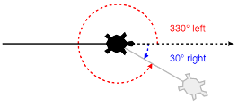
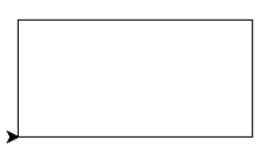
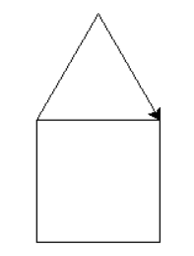
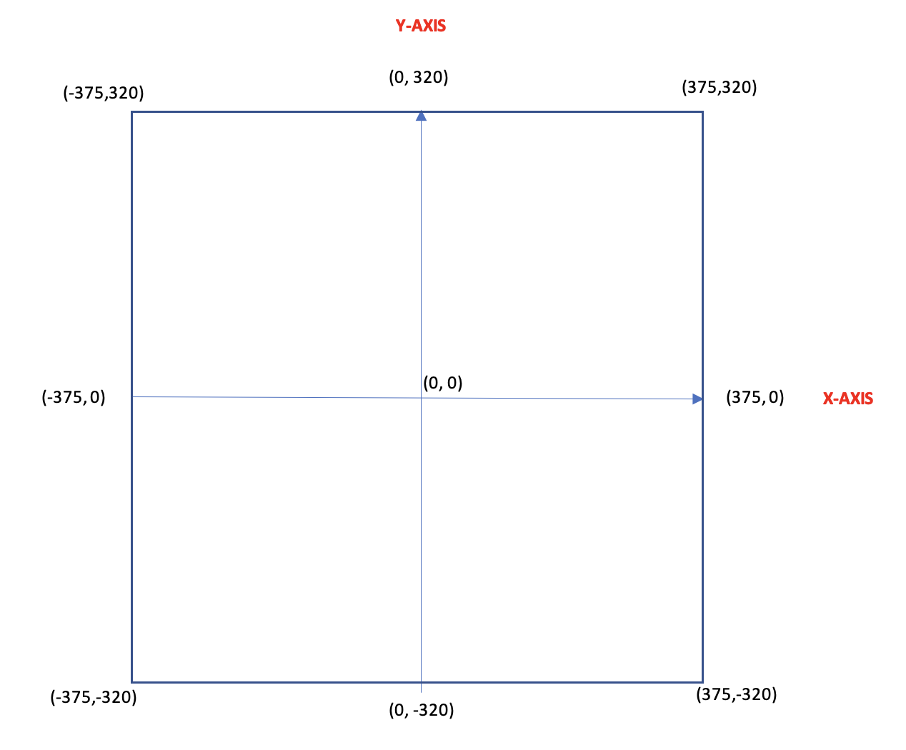

---
hide:
  - toc
---
# Turtle Programming

## 01 - Introduction to Turtle Programming

??? info "Lesson Notes"

    ??? info "01 - Introducing the Turtle"

        This term, you will start developing your knowledge of Python code to learn how to draw graphics on to the computer screen. 

        To do this, you will be using the Turtle module – which is simply an extra part of Python. 

        A module is a library of code written by a very intelligent person. 

        We need to import the functions (snippets of code) inside of the library so that we can use these extra features in our code. 

        **Importing the Turtle**

        To import all of the functions in the Turtle module, we need to add the following line of code to the start of every program we write this term:

        ``` python
        from turtle import *
        ```

        This line reads “**from the turtle module, import all of the functions inside of it.**” 

        This means you will have access to all the code to allow you to draw graphics on the screen.

        **What the Turtle Looks Like**

        When you run your first program with the Turtle, you will see a little symbol appear on the screen that will draw your graphics. 

        `Even though it doesn’t look like one, this is the **Turtle**.`

        **What can the Turtle do?**

        The Turtle is a great way to learn how to code using Python. 

        By using graphics, it’s a bit more interesting that the usual boring text you see on the screen when coding. 

        The Turtle is capable of drawing almost anything you dream up – you just need to know how to code it! 

        Cool 2D artworks and amazing patterns are just some of the things that the Turtle is capable of drawing.

        <figure markdown="span">
          { width="400" }
        </figure>

    ??? info "02 - Movement and Colour"

        **Moving the Turtle**

        You need to think of the Turtle as a pen – as it moves across your screen (which is your canvas), it will draw a line. We can move the Turtle forward and back. 

        The bigger the number, the further your turtle will go. Obviously, the smaller the number, the smaller the line that the Turtle will draw. **Try it out!**

        <figure markdown="span">
          { width="800" }
        </figure>

        **Changing Direction**

        By default, your Turtle will always start facing to the right. 

        It is, however, easy to change the direction in which the Turtle will draw a line. 

        To do this, you will need to tell the Turtle which direction to turn (left or right) and at how many degrees. 

        Below is an example of how many degrees you would need to turn the Turtle to head off towards the bottom right of the page. 

        You could either turn left or right – it’s just the number of degrees that you turn that will change.

        <figure markdown="span">
          { width="400" }
        </figure>

        **Examples**

        Let’s move your Turtle to create a right angle (90-degrees):

        <figure markdown="span">
          { width="600" }
        </figure>

        If we were to run the same code, but turn to the left, it would look like this:

        <figure markdown="span">
          { width="600" }
        </figure>

        By continuing to turn at 90-degrees, you are able to make your first shape:

        <figure markdown="span">
          { width="600" }
        </figure>

        **Changing Colour & Size**

        You are able to add a splash of colour to your lines by using the color function. 

        A list of all the different colours you can use can be seen below:

        <figure markdown="span">
          { width="900" }
        </figure>

        **Changing the Colour of the Pen**

        You can change the color of your pen by using the `color` function. 

        <figure markdown="span">
          { width="300" }
        </figure>

        **Changing the Line Thickness**

        You can change the thickness of your line by using the `pensize` function. 

        The higher the number, the thicker the line becomes:

        <figure markdown="span">
          { width="300" }
        </figure>

    ??? question "Tasks"

        ## Turing and Hopper

        ### 1 - Triangle

        **Write a program that will draw an equilateral triangle. Each side needs to be 100 steps in length. The angle at which you need to turn is 120-degrees.**

        <figure markdown="span">
        { width="150" }
        </figure>

        ??? info "🆘 Help!"

            [:fontawesome-brands-square-youtube: Code a Triangle Tutorial](https://youtu.be/T8BL-MHMZkc?si=g9l-IypKdliFY38i)
        
        ### 2 - Rectangle
        
        **Write a program that will draw a rectangle. The longer sides should be 200 steps in size. The shorter sides need to be 100 steps.**

        <figure markdown="span">
        { width="150" }
        </figure>

        ??? info "🆘 Help!"

            [:fontawesome-brands-square-youtube: Code a Square Tutorial](https://youtu.be/yhhsJgXyok8?si=I82dJrWYe_H-yIRy)

        ## Hopper

        ### 3 - House
        
        **Write a program that will draw a simple house. All sides of the house and roof need to be 100 steps long. When drawing the house, try and do it so that the house is drawn with one single line – meaning, you should not draw over any existing lines.**

        <figure markdown="span">
        { width="150" }
        </figure>

    ??? warning "Extra Credit Tasks"

        ### 1 - Heartbeat
        
        **Create a red heartbeat pattern that you would see on a heartbeat monitor.**
        
        **It will have 3 pulses that:**

          * **Moves 20 steps forward before the start of the pulse;**
          * **Turns 80° left to draw the start of the pulse;**
          * **Moves 20 steps up to draw the start of the pulse;**
          * **Turns 160° right at the top of the pulse;**
          * **Moves 40 steps to draw the main part of the pulse;**
          * **Turns 160° left at the bottom of the pulse;**
          * **Moves another 20 steps to draw the last part of the pulse;**
          * **Has a gap of 40 steps between each pulse**
        
        <figure markdown="span">
        { width="250" }
        </figure>

        ### 2 - Square Pattern
        
        **Write a program that will recreate the coloured pattern in the image on the right. You will need to use any 2 colours and a line thickness of 10.**
        
        **It might seem tricky, but once you work out the pattern, it is quite easy!**

        <figure markdown="span">
        { width="150" }
        </figure>

## 02 - Co-Ordinates

??? info "Lesson Notes"

    ??? info "Understanding Co-Ordinates"

        **Moving to Specific Co-Ordinates**

        The screen in Python has been setup with an x-axis and a y-axis. The default Turtle window size is approximately 750 x 640 steps. 

        It looks like this:

        <figure markdown="span">
          { width="800" }
        </figure>

        When you run your code, Python automatically positions your Turtle at the coordinates (0, 0) – which is the centre of the screen. 

        You can, however, move the Turtle to any position you like on the screen. 

        You will need to lift your Turtle up off the page, go to the desired coordinates and then put your Turtle back down on the page ready for drawing.

        <figure markdown="span">
          { width="700" }
        </figure>

    ??? question "Tasks"

        ## Turing and Hopper

        ### 1 - Squares

        **Write a program that will draw an equilateral triangle. Each side needs to be 100 steps in length. The angle at which you need to turn is 120-degrees.**

        * Write a program that will draw a square anywhere in the top left quadrant of the page with a green outline. 
        
        * Draw a second square anywhere in the bottom right quadrant of the page with an orange outline. 
        
        * Both squares must have equal sides of 100 steps and a pen size of 10. 

        `Save this program into your Computing folder as squares.py`
        

        <figure markdown="span">
        { width="450" }
        </figure>

        ## Hopper

        ### 2 - Name
        
        **Write a program that will draw a simple house. All sides of the house and roof need to be 100 steps long. When drawing the house, try and do it so that the house is drawn with one single line – meaning, you should not draw over any existing lines.**
        
        **Write a program that will draw your name on the screen using only lines. Each letter in your name needs to be a different colour and a different thickness to the other letters in your name. **
        
        **Feel free to use a nickname or your last name if it makes things easier.**
        
        Save this program into your Computing folder as name.py
        
        <figure markdown="span">
        { width="350" }
        </figure>

    ??? warning "Extra Credit Tasks"

        ### 1 - Heartbeat
        
        **Create a red heartbeat pattern that you would see on a heartbeat monitor.**
        
        **It will have 3 pulses that:**

          * **Moves 20 steps forward before the start of the pulse;**
          * **Turns 80° left to draw the start of the pulse;**
          * **Moves 20 steps up to draw the start of the pulse;**
          * **Turns 160° right at the top of the pulse;**
          * **Moves 40 steps to draw the main part of the pulse;**
          * **Turns 160° left at the bottom of the pulse;**
          * **Moves another 20 steps to draw the last part of the pulse;**
          * **Has a gap of 40 steps between each pulse**
        
        <figure markdown="span">
        { width="250" }
        </figure>

        ### 2 - Square Pattern
        
        **Write a program that will recreate the coloured pattern in the image on the right. You will need to use any 2 colours and a line thickness of 10.**
        
        **It might seem tricky, but once you work out the pattern, it is quite easy!**

        <figure markdown="span">
        { width="150" }
        </figure>