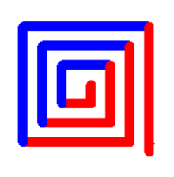

---
hide:
  - toc
---

# Co-Ordinates

??? info "Understanding Co-Ordinates"

    **Moving to Specific Co-Ordinates**

    The screen in Python has been setup with an x-axis and a y-axis. The default Turtle window size is approximately 750 x 640 steps. 

    It looks like this:

    <figure markdown="span">
      { width="800" }
    </figure>

    When you run your code, Python automatically positions your Turtle at the coordinates (0, 0) – which is the centre of the screen. 

    You can, however, move the Turtle to any position you like on the screen. 

    You will need to lift your Turtle up off the page, go to the desired coordinates and then put your Turtle back down on the page ready for drawing.

    <figure markdown="span">
      { width="700" }
    </figure>

??? question "Tasks"

    ## Turing and Hopper

    ### 1 - Squares

    **Write a program that will draw an equilateral triangle. Each side needs to be 100 steps in length. The angle at which you need to turn is 120-degrees.**

    * Write a program that will draw a square anywhere in the top left quadrant of the page with a green outline. 
    
    * Draw a second square anywhere in the bottom right quadrant of the page with an orange outline. 
    
    * Both squares must have equal sides of 100 steps and a pen size of 10. 

    `Save this program into your Computing folder as squares.py`
    

    <figure markdown="span">
    { width="450" }
    </figure>

    ## Hopper

    ### 2 - Name
    
    **Write a program that will draw a simple house. All sides of the house and roof need to be 100 steps long. When drawing the house, try and do it so that the house is drawn with one single line – meaning, you should not draw over any existing lines.**
    
    **Write a program that will draw your name on the screen using only lines. Each letter in your name needs to be a different colour and a different thickness to the other letters in your name. **
    
    **Feel free to use a nickname or your last name if it makes things easier.**
    
    Save this program into your Computing folder as name.py
    
    <figure markdown="span">
    { width="350" }
    </figure>

??? warning "Extra Credit Tasks"

    ### 1 - Heartbeat
    
    **Create a red heartbeat pattern that you would see on a heartbeat monitor.**
    
    **It will have 3 pulses that:**

      * **Moves 20 steps forward before the start of the pulse;**
      * **Turns 80° left to draw the start of the pulse;**
      * **Moves 20 steps up to draw the start of the pulse;**
      * **Turns 160° right at the top of the pulse;**
      * **Moves 40 steps to draw the main part of the pulse;**
      * **Turns 160° left at the bottom of the pulse;**
      * **Moves another 20 steps to draw the last part of the pulse;**
      * **Has a gap of 40 steps between each pulse**
    
    <figure markdown="span">
    { width="250" }
    </figure>

    ### 2 - Square Pattern
    
    **Write a program that will recreate the coloured pattern in the image on the right. You will need to use any 2 colours and a line thickness of 10.**
    
    **It might seem tricky, but once you work out the pattern, it is quite easy!**

    <figure markdown="span">
    { width="150" }
    </figure>

