# 👾 04 - Spawning the Enemy

=== "🕹️ Introduction"

    In this lesson, you’ll will start to make your game come alive. You will be learning how to make the enemy sprites fall using variables, an array, random and logic statements to make the enemy spawn at different places in your game screen.

    You’ll learn how to:

	* Use an __Array__ to store more than one __Sprite__.
	* How to effectively us __Logic__ statements to make your game think independently.
	* How to use __Random__ to keep the game fun by allowing tdifferent enemy to fall at __Random__ times

    By the end of the lesson, your game will have enemys to fight against!

=== "🧱 Building the Foundations"

    🎯 Success Criteria:

    Create enemy that falls from the top of the screen.

    ✅ Instructions

    1 - Open MakeCode Arcade.

    2 - Open your __Space Invaders__ project.

    3 - In the __Variables__ section select __Make a Variable__ and name it __Random Enemy__:

    <figure markdown="span">
    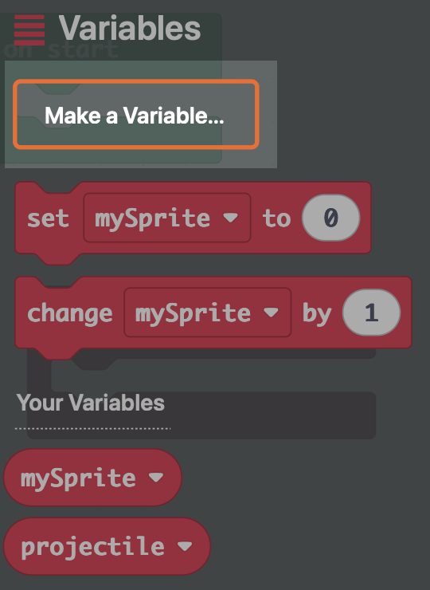{ width="200" }
    <figcaption></figcaption>
    </figure>

    4 - In the __Sprites__ section out drag out __Set mySprite to kind player__ and add it to the bottom of your __enemyFall__ Function:

    <figure markdown="span">
    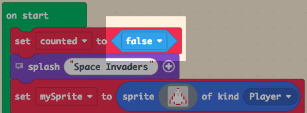{ width="500" }
    <figcaption></figcaption>
    </figure>

    🚨 Change the __mySprite__ to __randomEnemy__ by clicking on the little arrow

    🚨 Change the of kind __Player__ to __Enemy__ by clicking on the little arrow

    5 - In the __Advanced__ section, select __Arrays__:

    <figure markdown="span">
    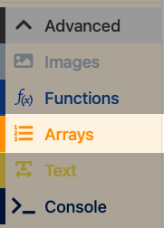{ width="200" }
    <figcaption></figcaption>
    </figure>

    And drag out a __get random value from list__ and add it to the __grey square__:

    <figure markdown="span">
    { width="600" }
    <figcaption></figcaption>
    </figure>

    6 - In the __Sprites__ section drag a __set mySprite auto destroy <off>__ and add it to the bottom of your __enemyFall__ Function:

    <figure markdown="span">
    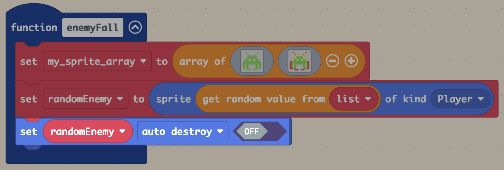{ width="600" }
    <figcaption></figcaption>
    </figure>

    🚨 Change __auto destroy__ to __invisible__ by clicking on the little arrow

    🚨 Change the slider from __OFF__ to __ON__

    7 - In the __Sprites__ section out drag out __Set mySprite x to 0__ and add it to the bottom of your __enemyFall__ Function::

    <figure markdown="span">
    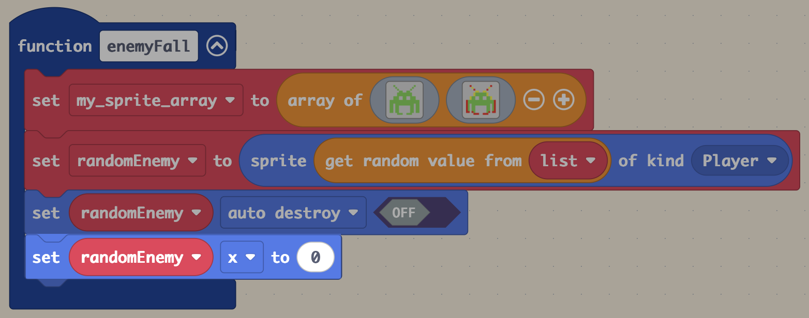{ width="600" }
    <figcaption></figcaption>
    </figure>

    🚨 Change  __my sprite__ to __randomEnemy__

    🚨 Change __x__ to __vy (velocity y)__ by clicking on the little arrow

    🚨 Change the __vy (velocity y)__ to 60

    8 - In the __Game__ section drag out __on game update every 500ms__ and add it to your __workspace__:

    <figure markdown="span">
    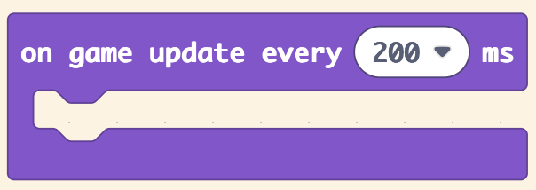{ width="350" }
    <figcaption></figcaption>
    </figure>

    🚨 Change __500 ms__ to __200 ms__ by clicking on the little arrow

    9 - In the __Logic__ section drag out __if <true> then__ and add it to your __on game update__ block:

    <figure markdown="span">
    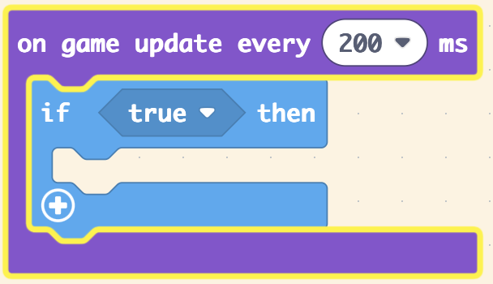{ width="300" }
    <figcaption></figcaption>
    </figure>

    11 - In the __Logic__ section drag out __< 0 = 0 >__ and add it to your __if <true> then__ block:

    <figure markdown="span">
    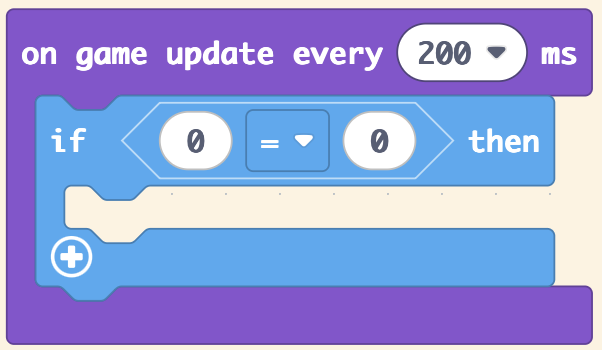{ width="300" }
    <figcaption></figcaption>
    </figure>

    🚨 Change __=__ to __>__ by clicking on the little arrow

    🚨 Change the 2nd __0__ to __120__

    12 - In the __Sprites__ section drag out __mySprite x__ and add it to the first __0__:

    <figure markdown="span">
    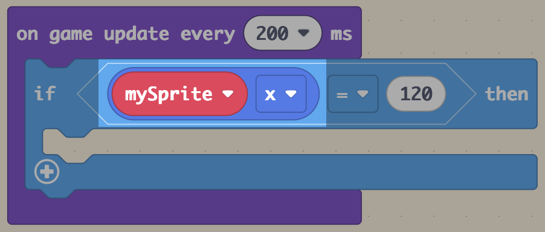{ width="400" }
    <figcaption></figcaption>
    </figure>

    🚨 Change __mySprite__ to __randomEnemy__ by clicking on the little arrow

    🚨 Change the  __x__ to __y__

    13 - From the __enemyFall__ function find the code block below and duplicate it:

    🚨 To duplicate a block right click on the block and select __duplicate__.

    <figure markdown="span">

    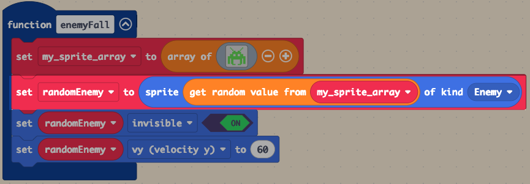{ width="700" }
        
    </figure>

    add the duplicated block to your __if__ block:

    <figure markdown="span">

    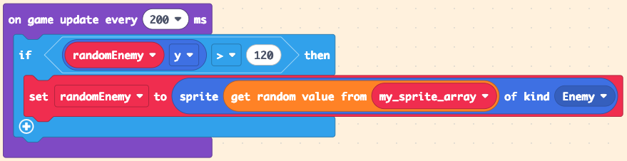{ width="700" }
        
    </figure>

    14 - In the __Sprites__ section drag out __set my sprite posistion to x: 0 y: 0__ and add it to your __if__ block:

    <figure markdown="span">

    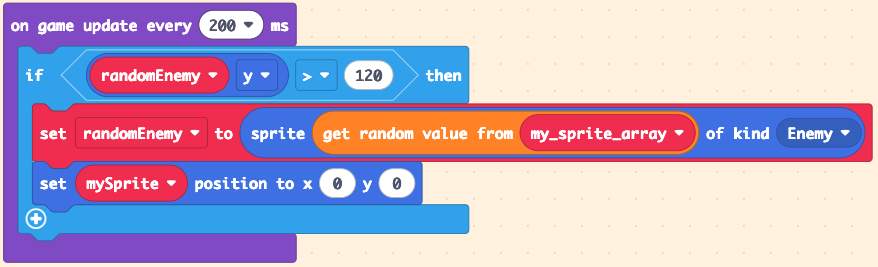{ width="700" }
        
    </figure>

    🚨 Change __mySprite__ to __randomEnemy__ by clicking on the little arrow

    15 - In the __Math__ section drag out __pick random 0 to 0__ and add it to the __x co-ordinate__ in the __set random enemy__ block:

    <figure markdown="span">

    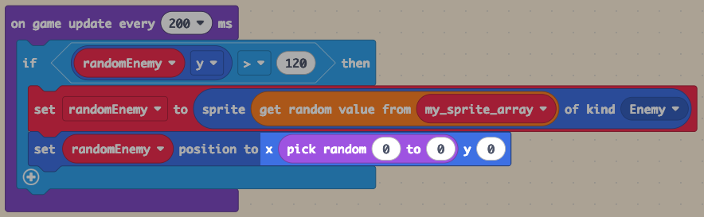{ width="700" }
        
    </figure>

    🚨 Keep the 1st number as __0__ and set the 2nd number to __120__ 

    16 - Find this block in your __enemyFall__ Function and duplicate it:

    <figure markdown="span">

    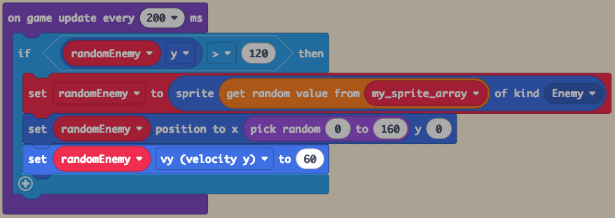{ width="700" }
    
    </figure>

    14 - Add your duplicated block to your __if......then__ block:

    <figure markdown="span">

    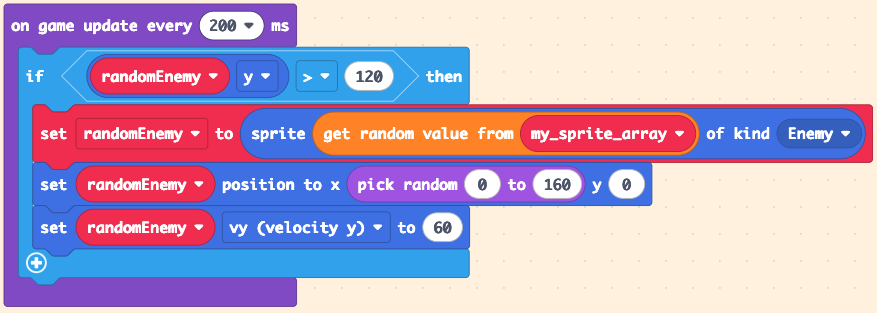{ width="700" }
    
    </figure>

    15 - Add your duplicated block to your __if......then__ block:

    <figure markdown="span">

    { width="700" }
    
    </figure>

    16 - Finally, in __Functions__ grab a __call enemyFall__ block and add it to the bottom of your start block:

    <figure markdown="span">

    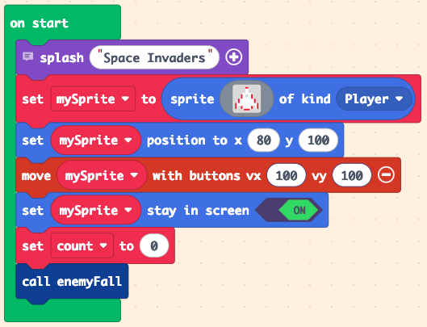{ width="450" }
    
    </figure>

    🧪 Checkpoint

    You will now be able to spawn random enemy in a controlled manner.

=== "🎮 Turing" 

    🎯 Success Criteria:
    
    Create a counter to for your game to see how many aliens have fallen

    💡 - This will be needed in future lessons

    ✅ Instructions:

    1. Create a new variable called __count__

    2. Add a __set count to 0__ block to the bottome of your start block.

    3. In your __if block__ add grab a __change count by 1__

    4. To check if your count is working add this block to the end of your __if__ block. 

    5. Once you know it is working you can __delete__ your __change count by 1__ block

    🚨 DO NOT DELETE THE __Set Count to 0__ IN YOUR START BLOCK

=== "👾 Hopper"    

    🎯 Success Criteria: 
    
    Add a another random enemy spawn to your game.

    💡 When we spawn our enemies, the bonus enemies will generate more points or remove more lives🕹️

    ✅ Instructions:

    1.  Duplicate the code blocks from __enemyFall__ that are missing from your __bonusEnemy__ function and add them to your __bonusEnemy__ function
    
    2.  Add another __if......then__ block to the __if......then__ block you have already created:

    <figure markdown="span">

    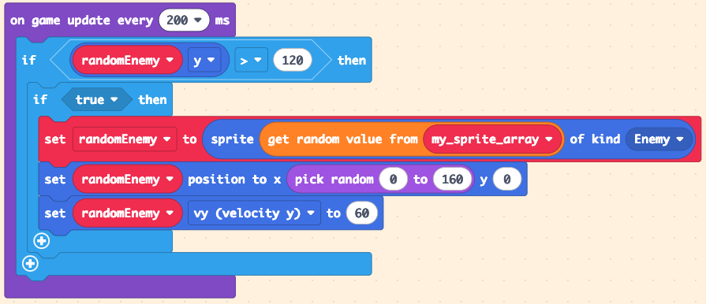{ width="600" }
    
    </figure>
    
    3.  Using  the __count variable__ you have just created, see if you can work out how to make your __bonusEnemy__  fall when the __count variable__ reaches the number 5.

    🚨 Hint: you will need one of these: 

    <figure markdown="span">

    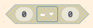{ width="200" }
    
    </figure>

    🌶️🌶️🌶️ Extra Challenge:

    Using the blocks below make your bonus enemy fall whenever your __count divided by 5 = 0 (doesn't have a remainder)__:

    <figure markdown="span">

    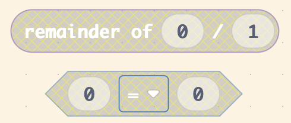{ width="200" }
    
    </figure>

    This is a __math function__ called __modulo__ 
    
    __Modulo__ is a key component in computing programming.

    Once you have mastered this, you can apply this technique to different arrays and different bonuses. 

[:octicons-arrow-left-24: Back](lessons.md){ .md-button }