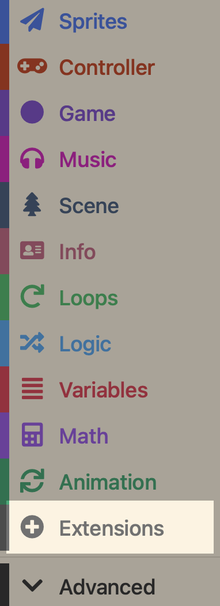
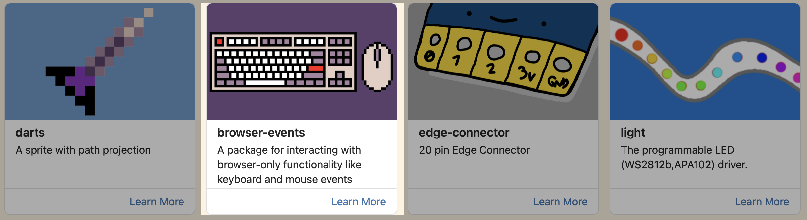
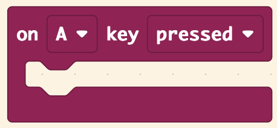
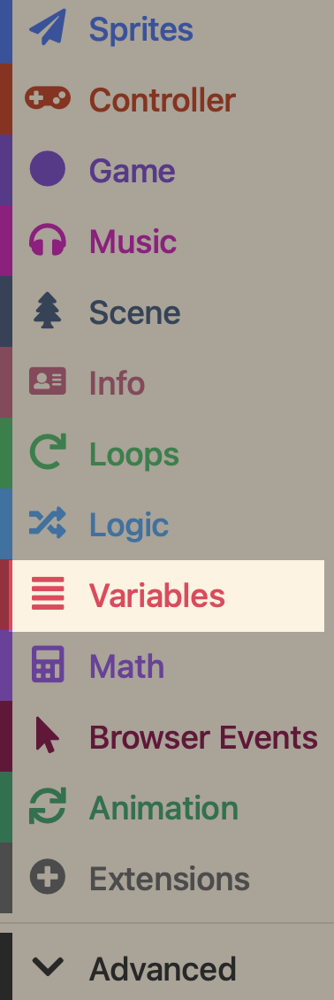
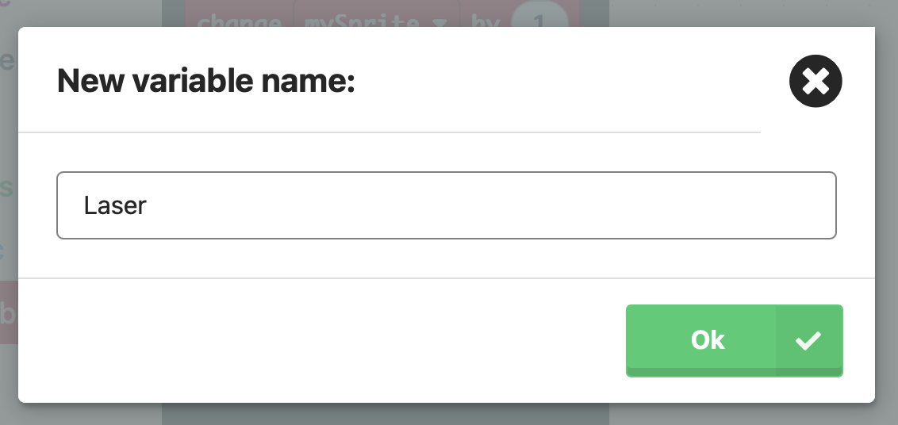
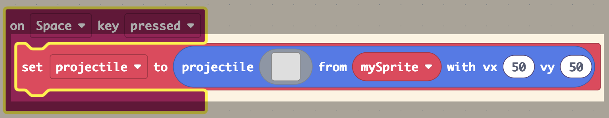
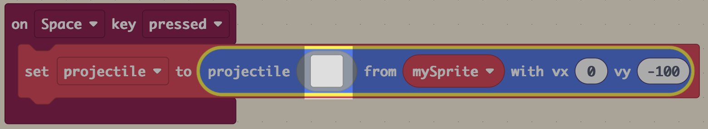
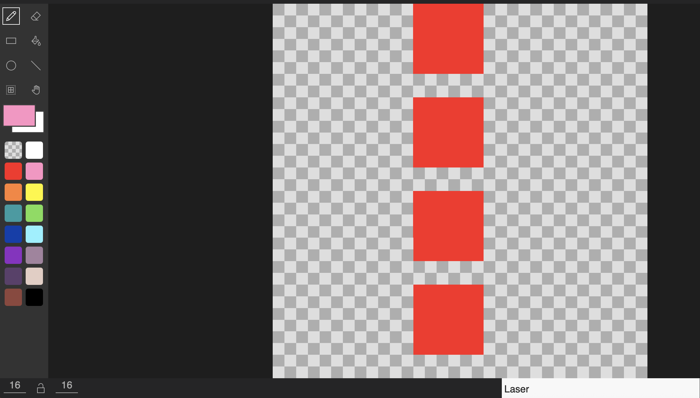
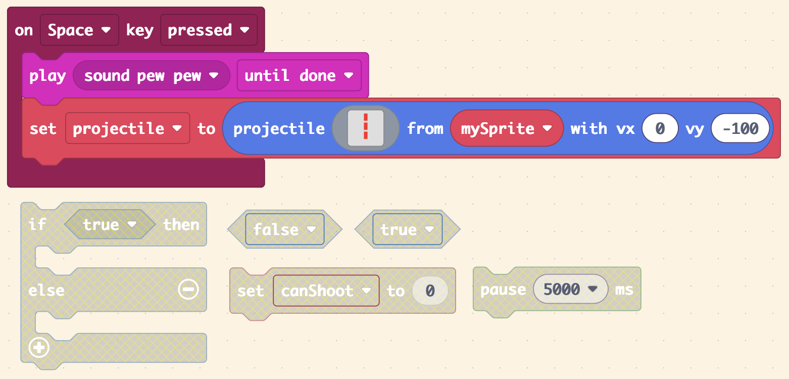

# 🔫 02 - Shooting Lasers

=== "🕹️ Introduction"

    In this lesson, you’ll give your player sprite the ability to fire lasers or bullets when a button is pressed — just like in a real space shooter!

    You’ll learn how to:

	* Use the __Space Bar__ to fire a projectile.
	* Make the projectile move upwards on the screen.
	* Keep the game fun by allowing the player to shoot again and again.

    By the end of the lesson, your spaceship will be ready to fight back against enemies in future lessons!

=== "🧱 Building the Foundations"

    🎯 Success Criteria:

    Make the __Space bar__ shoot lasers upwards

    ✅ Instructions

    1 - Open MakeCode Arcade.

    2 - Open your __Space Invaders__ project.

    3 - In the __Extensions__ section:

    <figure markdown="span">
    { width="200" }
    <figcaption></figcaption>
    </figure>

    Select __Browser Events__ and return to the workspace:

    <figure markdown="span">
    { width="700" }
    <figcaption></figcaption>
    </figure>

    4 - Drag out __on A key pressed__ and add it to your workspace:

    <figure markdown="span">
    { width="250" }
    <figcaption></figcaption>
    </figure>

    🚨 Change the __A__ to __Space__ by clicking on the little arrow

    5 - In the __Variables Section__:

    <figure markdown="span">
    { width="200" }
    <figcaption></figcaption>
    </figure>

    Select __Make a Variable__:
    
    <figure markdown="span">
    { width="250" }
    <figcaption></figcaption>
    </figure>

    And name it __Laser__:

    <figure markdown="span">
    { width="400" }
    <figcaption></figcaption>
    </figure>

    6 - Drag a __set projectile to projectile from mySprite with vx:50  vy:50__ and add it to the __on Space Pressed__ block. 

    <figure markdown="span">
    { width="500" }
    <figcaption></figcaption>
    </figure>

    🚨 Change __projectile__ to __Laser__ and set the coordinates to __vx: 0 vy: -100__

    7 - Click on the Grey square:

    <figure markdown="span">
    { width="500" }
    <figcaption></figcaption>
    </figure>

    and create your __laser__:

    <figure markdown="span">
    { width="500" }
    <figcaption></figcaption>
    </figure>

    🧪 Checkpoint

    Pressing __Space__ should now shoot a laser upward from your ship.

=== "🎮 Turing" 

    🎯 Success Criteria:
    
    Make your game play a sound when you press __Space__ to fire.

    💡 This helps your game feel more realistic and fun.

    ✅ Instructions:

	1.	Go to the __Music__ section
	2.	Drag out the __play sound until done__ block and add it to the __top__ of your __on Space key pressed__ block
    3.  Change the sound to __pew pew__

    🧩 Challenge Yourself:

    Try different sounds or make your own by changing the __play sound until your done__ to __play melody until done__.

=== "👾 Hopper"    

    🎯 Success Criteria: 
    
    Stop a player from spamming the fire button

    💡 This makes your game have a more classic arcade game feel🕹️

    ✅ Instructions:

    1.	Using the blocks below add a short delay between shots to your __on Space key pressed__ block:
    
    <figure markdown="span">
    { width="500" }
    <figcaption></figcaption>
    </figure>
    
    🚨  Some blocks may need to be __duplicated__

    🚨  You will need to create a __Variable__ called __canShoot__

[:octicons-arrow-left-24: Back](lessons.md){ .md-button }

    