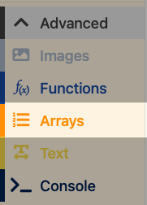

# 👾 03 - Creating the Enemy

=== "🕹️ Introduction"

    In this lesson, you’ll give your player sprite the ability to fire lasers or bullets when a button is pressed — just like in a real space shooter!

    You’ll learn how to:

	* Use the __Space Bar__ to fire a projectile.
	* Make the projectile move upwards on the screen.
	* Keep the game fun by allowing the player to shoot again and again.

    By the end of the lesson, your spaceship will be ready to fight back against enemies in future lessons!

=== "🧱 Building the Foundations"

    🎯 Success Criteria:

    Create enemy that falls from the top of the screen.

    ✅ Instructions

    1 - Open MakeCode Arcade.

    2 - Open your __Space Invaders__ project.

    3 - In the __Variables__ section, select __Make a Variable__. Name the new variable __randomEnemyArray__:

    4 - In the __Advanced__ section select __Functions__ and then __Make a Function__:

    <figure markdown="span">
    { width="200" }
    <figcaption></figcaption>
    </figure>

    5 - In the __Edit Function__ pop up, click on __doSomething__, rename the Function __enemyFall__ and select __Done__:

    <figure markdown="span">
    { width="700" }
    <figcaption></figcaption>
    </figure>

    6 - In the __Advanced__ section, select __Arrays__:

    <figure markdown="span">
    { width="200" }
    <figcaption></figcaption>
    </figure>

    And drag out a __set list to array of (0) (1) - +__ and add it to the __function enemyFall__ block:

    <figure markdown="span">
    { width="400" }
    <figcaption></figcaption>
    </figure>

    🚨 Change __list__ to __randomEnemyArray__ by clicking on the little arrow

    7 - In the __Sprites__ section drag a __sprite of kind player__ into the workspace . 

    <figure markdown="span">
    { width="250" }
    <figcaption></figcaption>
    </figure>

    8 - Click on the __Grey Square__:

    <figure markdown="span">
    { width="250" }
    <figcaption></figcaption>
    </figure>

    and drag it into __array of (0)__:

    <figure markdown="span">
    { width="300" }
    <figcaption></figcaption>
    </figure>

    9 - Double click on the __Grey Square__ and draw your alien:

    <figure markdown="span">
    { width="600" }
    <figcaption></figcaption>
    </figure>

    🧪 Checkpoint

    You will now have an enemy in your game that is ready to be spawned in the next lesson!

=== "🎮 Turing" 

    🎯 Success Criteria:
    
    Create another 3 Aliens for your game to add different dimensions to your game.

    💡 This helps your game feel more complete and gives players a clear starting point.

    ✅ Instructions:

	1.	Find the __Function enemyFall__ __Game__
	2.	Click on the __+__ sign to add another location to your array.
	3.	Click on the grey square and create your next enemy
    4. repeat the step above to add a third enemy 

=== "👾 Hopper"    

    🎯 Success Criteria: 
    
    Create another __Array__ to store your __bonusEnemy__

    💡 When we spawn our enemies, the bonus enemies will generate more points or remove more lives🕹️

    ✅ Instructions:

    1.	Create another __Array__  and name it __bonusEnemy__ 
    
    2.  Add the array to the __enemyFall__ Function and add at least __3 bonus enemies__
    
[:octicons-arrow-left-24: Back](lessons.md){ .md-button }