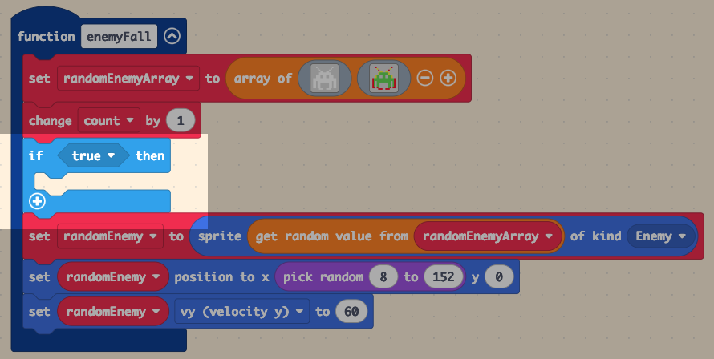
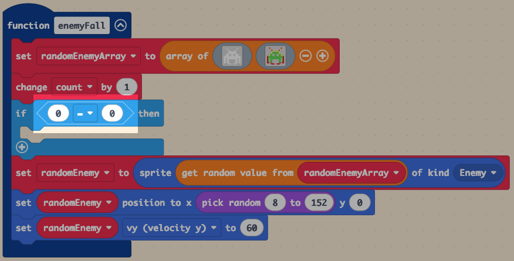
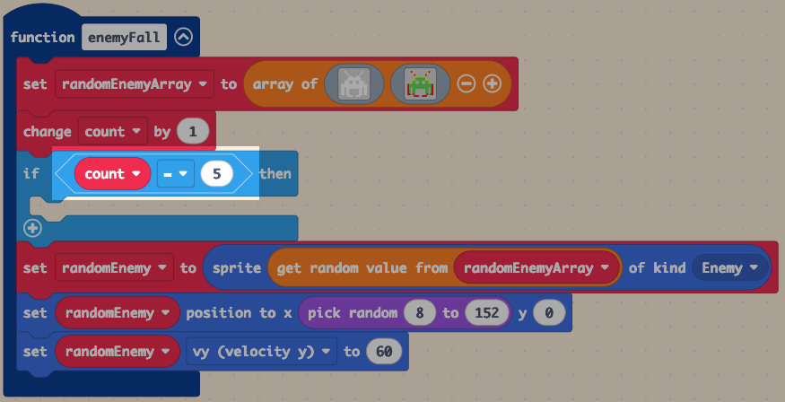
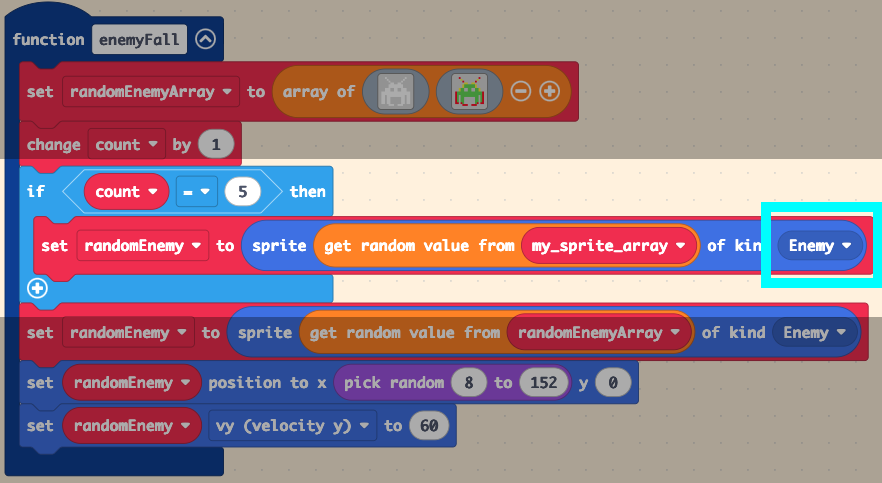
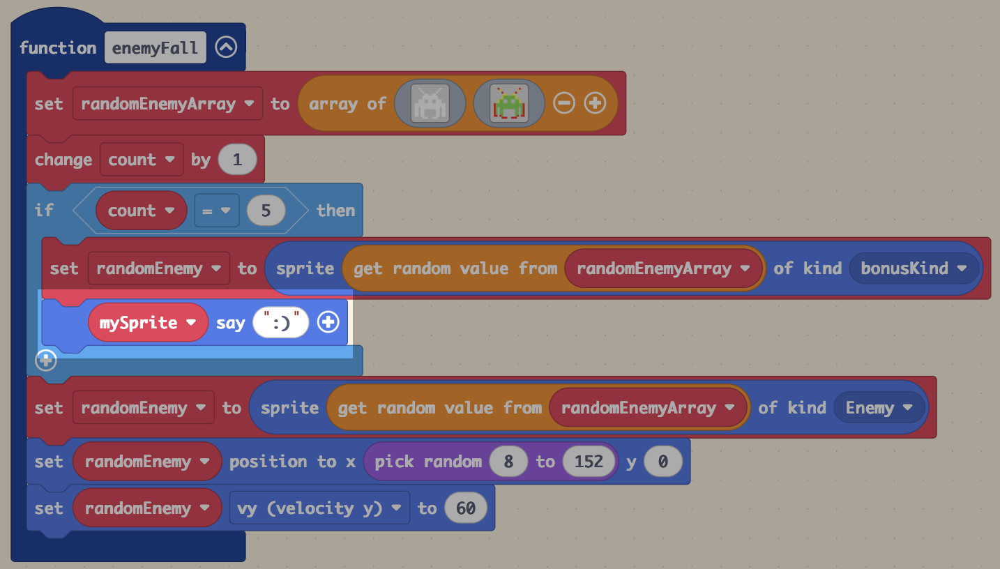
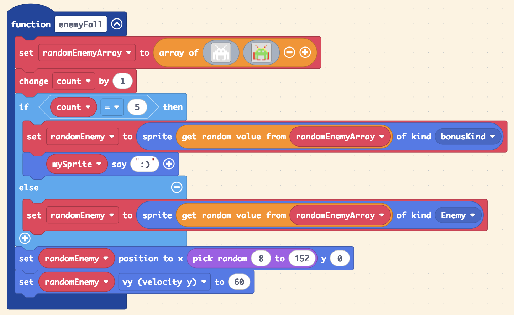
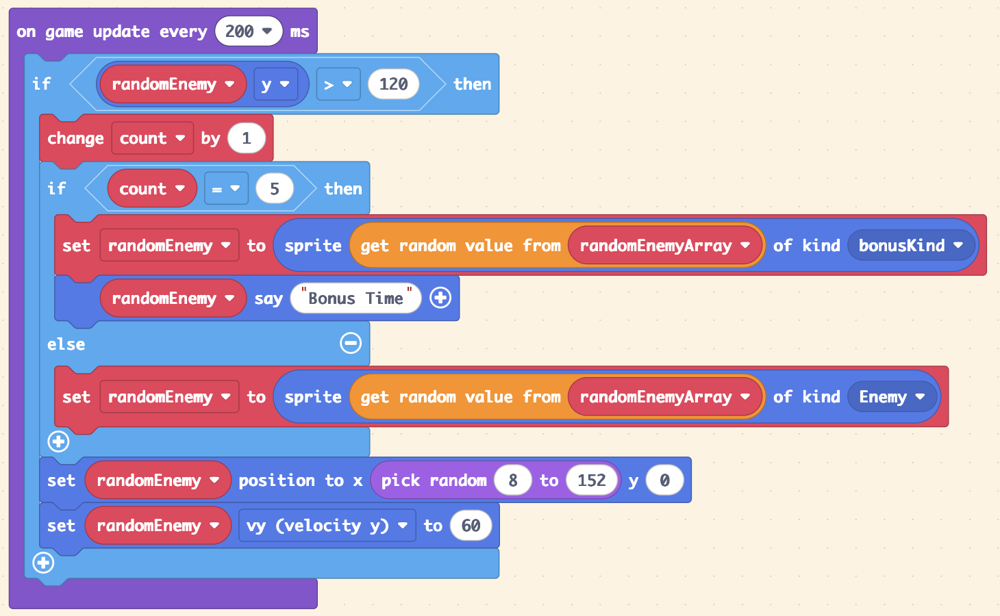
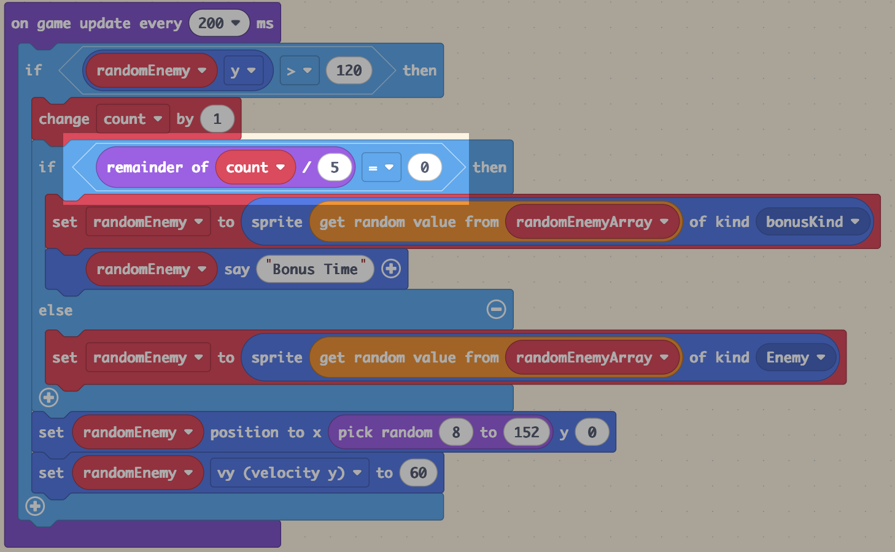

# 👾 05 - Adding the Bonus

=== "🕹️ Introduction"

    In this lesson, you’ll will start to make your game come alive. You will be learning how to make the enemy sprites fall using variables, an array, random and logic statements to make the enemy spawn at different places in your game screen.

    You’ll learn how to:

	* Use an __Array__ to store more than one __Sprite__.
	* How to effectively us __Logic__ statements to make your game think independently.
	* How to use __Random__ to keep the game fun by allowing tdifferent enemy to fall at __Random__ times

    By the end of the lesson, your game will have enemys to fight against!

=== "🧱 Building the Foundations"

    🎯 Success Criteria:

    Create a count check in our program to see if a bonus enemy should fall and give the player extra points.

    ✅ Instructions

    1 - Open MakeCode Arcade.

    2 - Open your __Space Invaders__ project.

    3 - In the __Logic__ section drag out __if true then__ and add it below the __change count by 1__ in your __enemyFall__ Function:

    <figure markdown="span">
    { width="700" }
    <figcaption></figcaption>
    </figure>

    4 - In the __Logic__ section drag out __Comparisson Block__ and add it to your __if true then__ block:

    <figure markdown="span">
    { width="700" }
    <figcaption></figcaption>
    </figure>

    5 - In the __Variables__ section select your __count__ variable and add it your comparison block: 

    <figure markdown="span">
    { width="700" }
    <figcaption></figcaption>
    </figure>

    🚨 Change the __0__ to __5__ on the other side

    6 - Right click on on __set randomEnemy to__ and duplicate the block. Add this duplicated block to your __if.....then__ block:

    <figure markdown="span">
    { width="700" }
    <figcaption></figcaption>
    </figure>

    🚨 Change the __kind__ from __Enemy__ to __bonusKind__ by clicking on the little arrow and selecting __create new kind__

    7 - From the __Sprites__ section find __My sprite say__ and add it below your __bonusKind__ block:

    <figure markdown="span">
    { width="700" }
    <figcaption></figcaption>
    </figure>

    🚨 Change __mySprite__  to __randomEnemy__ and change the smiley face to __Bonus Time__

    8 - Click on the little __+__ sign at the bottom of your __if.......then__ block and move the __enemy__ kind block into it:

    <figure markdown="span">
    { width="700" }
    <figcaption></figcaption>
    </figure>

    9 - Now you need to duplicate all the code you have just created and add it your __on game update block__:

    🚨 Make sure it looks exactly this or code will not __work__

    <figure markdown="span">
    { width="700" }
    <figcaption></figcaption>
    </figure>

    You will now be able to spawn random enemy in a controlled manner.

=== "🎮 Turing" 

    🎯 Success Criteria:
    
    Create a counter to for your game to see how many aliens have fallen

    💡 - This will be needed in future lessons

    ✅ Instructions:

    1. Click on the little __+__ sign at the bottom of your __if.......then__ block and end more point checks. 

    2. Make it say bonus at __10__, __15__ and __20__

=== "👾 Hopper"    

    🎯 Success Criteria: 
    
    Use the __modulo__ function to make your __bonus enemy__ fall whenever the __remainder__ of a __divisible__ calculation is __0__.

    💡 __Modulo__ is a key component in computing programming.  Once you have mastered this, you can apply this technique to different arrays and different bonuses. 

    ✅ Instructions:

    1 - Using the blocks below, make your bonus enemy fall whenever your __count divided by 5 = 0 (doesn't have a remainder)__:

    🚨 Note: you will need to change all claculations within your program or it will be break

    <figure markdown="span">

    { width="700" }
    
    </figure>

    
    
    

[:octicons-arrow-left-24: Back](lessons.md){ .md-button }