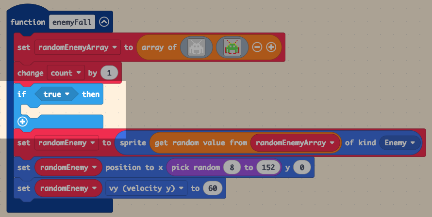
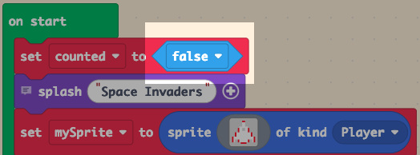
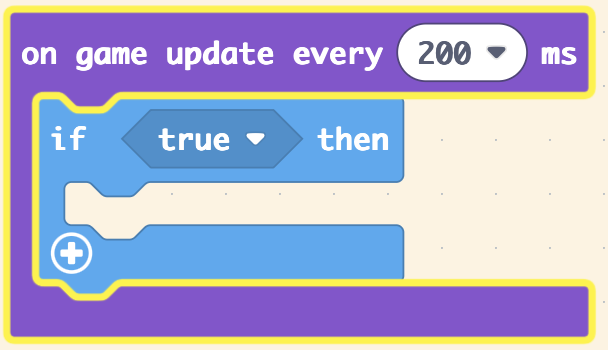
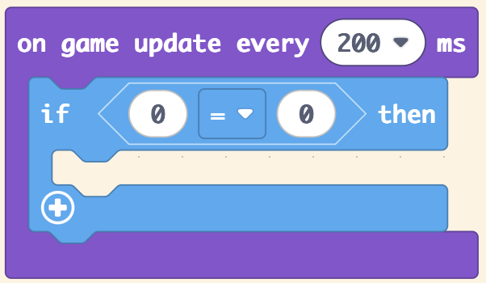
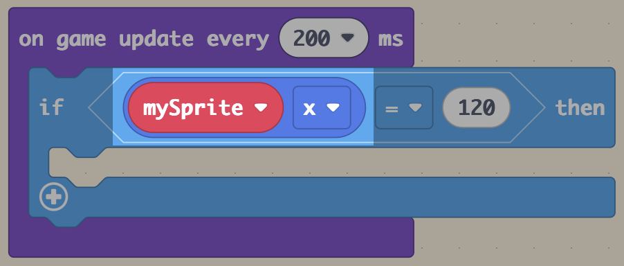
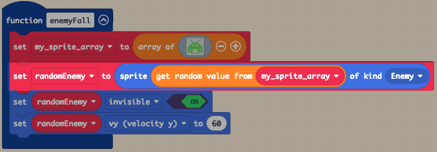
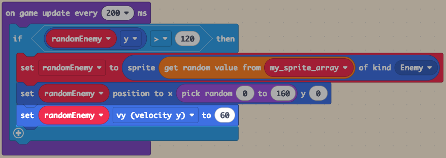
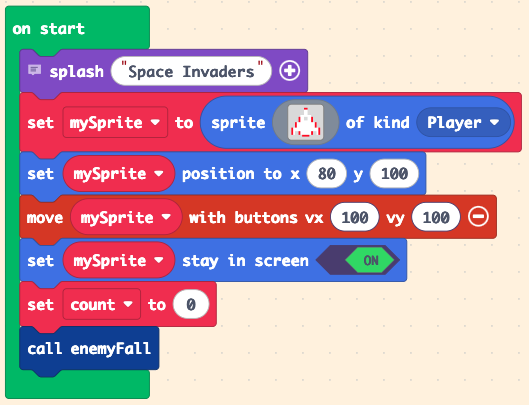
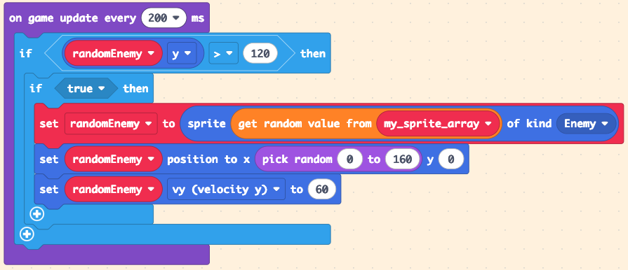
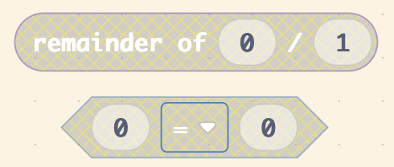

# 💥 Lesson 4: Destroying Enemies

🎯 Goal

✅ Steps

In ||sprites:Sprites||, use on projectile of kind Projectile overlaps enemy of kind Enemy.

Inside it:

Use destroy enemy.

Add info.changeScoreBy(1) to increase score.

Optional: Add a visual effect (like fire or spray).

🧪 Checkpoint

Enemies disappear and score increases when hit by lasers.

# 👾 05 - Destroying Enemies

=== "🕹️ Introduction"

    In this lesson, 

    You’ll learn how to:

	* Use an __Array__ to store more than one __Sprite__.
	* How to effectively us __Logic__ statements to make your game think independently.
	* How to use __Random__ to keep the game fun by allowing tdifferent enemy to fall at __Random__ times

    By the end of the lesson, your game will have enemys to fight against!

=== "🧱 Building the Foundations"

    🎯 Success Criteria:

    Destroy enemies when hit by a laser.

    Note: To make our program work as it should, we will need to change some of our previously created code.

    ✅ Instructions

    1 - Open MakeCode Arcade.

    2 - Open your __Space Invaders__ project.

    3 - In the __Variables__ section, select __Make a Variable__. Name the new variable __counted__:

    4 - From the __Variables__ section grab a __set 'variable name' to 0__ and add it to the top of your __on start__ block: 

    <figure markdown="span">
    { width="400" }
    <figcaption></figcaption>
    </figure>
    
    🚨 Change the __variable name__ to __counted__ by clicking on the little arrow
    
    5 - In the __Logic__ section grab a __false__ block and add it to the __0__ of your __set counted to__ block:

    <figure markdown="span">
    { width="400" }
    <figcaption></figcaption>
    </figure>

    6 - In the __Logic__ section drag out __if true then__ and add it below your __change count by 1__ block in your __enemyFall__ Function:

    <figure markdown="span">
    { width="600" }
    <figcaption></figcaption>
    </figure>

    1 - Open MakeCode Arcade.

    2 - Open your __Space Invaders__ project.

    3 - In the __Variables__ section select __Make a Variable__ and name it __Random Enemy__:

    <figure markdown="span">
    { width="200" }
    <figcaption></figcaption>
    </figure>

    4 - In the __Sprites__ section out drag out __Set mySprite to kind player__ and add it to the bottom of your __enemyFall__ Function:

    <figure markdown="span">
    { width="500" }
    <figcaption></figcaption>
    </figure>

    🚨 Change the __mySprite__ to __randomEnemy__ by clicking on the little arrow

    🚨 Change the of kind __Player__ to __Enemy__ by clicking on the little arrow

    5 - In the __Advanced__ section, select __Arrays__:

    <figure markdown="span">
    { width="200" }
    <figcaption></figcaption>
    </figure>

    And drag out a __get random value from list__ and add it to the __grey square__:

    <figure markdown="span">
    { width="600" }
    <figcaption></figcaption>
    </figure>

    6 - In the __Sprites__ section drag a __set mySprite auto destroy <off>__ and add it to the bottom of your __enemyFall__ Function:

    <figure markdown="span">
    { width="600" }
    <figcaption></figcaption>
    </figure>

    🚨 Change __auto destroy__ to __invisible__ by clicking on the little arrow

    🚨 Change the slider from __OFF__ to __ON__

    7 - In the __Sprites__ section out drag out __Set mySprite x to 0__ and add it to the bottom of your __enemyFall__ Function::

    <figure markdown="span">
    { width="600" }
    <figcaption></figcaption>
    </figure>

    🚨 Change  __my sprite__ to __randomEnemy__

    🚨 Change __x__ to __vy (velocity y)__ by clicking on the little arrow

    🚨 Change the __vy (velocity y)__ to 60

    8 - In the __Game__ section drag out __on game update every 500ms__ and add it to your __workspace__:

    <figure markdown="span">
    { width="350" }
    <figcaption></figcaption>
    </figure>

    🚨 Change __500 ms__ to __200 ms__ by clicking on the little arrow

    9 - In the __Logic__ section drag out __if <true> then__ and add it to your __on game update__ block:

    <figure markdown="span">
    { width="300" }
    <figcaption></figcaption>
    </figure>

    11 - In the __Logic__ section drag out __< 0 = 0 >__ and add it to your __if <true> then__ block:

    <figure markdown="span">
    { width="300" }
    <figcaption></figcaption>
    </figure>

    🚨 Change __=__ to __>__ by clicking on the little arrow

    🚨 Change the 2nd __0__ to __120__

    12 - In the __Sprites__ section drag out __mySprite x__ and add it to the first __0__:

    <figure markdown="span">
    { width="400" }
    <figcaption></figcaption>
    </figure>

    🚨 Change __mySprite__ to __randomEnemy__ by clicking on the little arrow

    🚨 Change the  __x__ to __y__

    13 - From the __enemyFall__ function find the code block below and duplicate it:

    🚨 To duplicate a block right click on the block and select __duplicate__.

    <figure markdown="span">

    { width="700" }
        
    </figure>

    add the duplicated block to your __if__ block:

    <figure markdown="span">

    { width="700" }
        
    </figure>

    14 - In the __Sprites__ section drag out __set my sprite posistion to x: 0 y: 0__ and add it to your __if__ block:

    <figure markdown="span">

    { width="700" }
        
    </figure>

    🚨 Change __mySprite__ to __randomEnemy__ by clicking on the little arrow

    15 - In the __Math__ section drag out __pick random 0 to 0__ and add it to the __x co-ordinate__ in the __set random enemy__ block:

    <figure markdown="span">

    { width="700" }
        
    </figure>

    🚨 Keep the 1st number as __0__ and set the 2nd number to __120__ 

    16 - Find this block in your __enemyFall__ Function and duplicate it:

    <figure markdown="span">

    { width="700" }
    
    </figure>

    14 - Add your duplicated block to your __if......then__ block:

    <figure markdown="span">

    { width="700" }
    
    </figure>

    15 - Add your duplicated block to your __if......then__ block:

    <figure markdown="span">

    { width="700" }
    
    </figure>

    16 - Finally, in __Functions__ grab a __call enemyFall__ block and add it to the bottom of your start block:

    <figure markdown="span">

    { width="450" }
    
    </figure>

    🧪 Checkpoint

    You will now be able to spawn random enemy in a controlled manner.

=== "🎮 Turing" 

    🎯 Success Criteria:
    
    Create a counter to for your game to see how many aliens have fallen

    💡 - This will be needed in future lessons

    ✅ Instructions:

    1. Create a new variable called __count__

    2. Add a __set count to 0__ block to the bottome of your start block.

    3. In your __if block__ add grab a __change count by 1__

    4. To check if your count is working add this block to the end of your __if__ block. 

    5. Once you know it is working you can __delete__ your __change count by 1__ block

    🚨 DO NOT DELETE THE __Set Count to 0__ IN YOUR START BLOCK

=== "👾 Hopper"    

    🎯 Success Criteria: 
    
    Add a another random enemy spawn to your game.

    💡 When we spawn our enemies, the bonus enemies will generate more points or remove more lives🕹️

    ✅ Instructions:

    1.  Duplicate the code blocks from __enemyFall__ that are missing from your __bonusEnemy__ function and add them to your __bonusEnemy__ function
    
    2.  Add another __if......then__ block to the __if......then__ block you have already created:

    <figure markdown="span">

    { width="600" }
    
    </figure>
    
    3.  Using  the __count variable__ you have just created, see if you can work out how to make your __bonusEnemy__  fall when the __count variable__ reaches the number 5.

    🚨 Hint: you will need one of these: 

    <figure markdown="span">

    { width="200" }
    
    </figure>

    🌶️🌶️🌶️ Extra Challenge:

    Using the blocks below make your bonus enemy fall whenever your __count divided by 5 = 0 (doesn't have a remainder)__:

    <figure markdown="span">

    { width="200" }
    
    </figure>

    This is a __math function__ called __modulo__ 
    
    __Modulo__ is a key component in computing programming.

    Once you have mastered this, you can apply this technique to different arrays and different bonuses. 

[:octicons-arrow-left-24: Back](lessons.md){ .md-button }