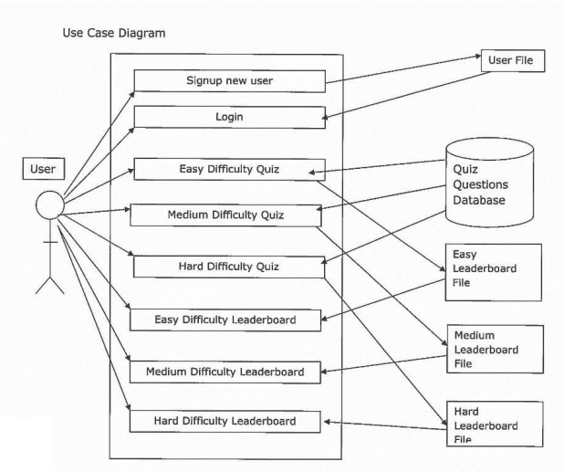

# Analysis

## Description of Problem 

I intend to develop a quiz based on well-known historical events. The quiz will have three levels of difficulty so that the user can select a level on either their historical knowledge or how much of a challenge they want to set themselves. I intend to include the following features: login facilities, help screens, each level of difficulty will have a quiz selected at random, each quiz will have multiple choice questions and a leader board that can be sorted. 

The end-users of my quiz will specifically be S1-S6 students who study history at school but also anybody who is interested in history and wants to test their knowledge.

My project meets the advanced higher computing requirements because it will have a user interface suitable for S1-S6 students which will be easy to use and will validate all inputs. 

My project will interface with stored data within a database for the questions (using SQL) and also with a text file to store the login facilities (these will be processed using an array of records). 

My project will also use a sort algorithm to arrange the details leader board details.

## UML Case Diagrams

<figure markdown="span">
  { width="600" }
</figure>

## Requirements Specification

### Scope 

The scope of my project will include: 

* A completed design with pseudocode, data dictionary, query design and wireframes showing the intended interface for the quiz 

* A working quiz and a database with multiple choice quiz questions 

* Completed test plan with descriptions of a test persona, test cases and expected outputs 

* The results of final testing 

* An evaluation report 

### Constraints 

There are a number of technical, economic and time constraints that will apply to this development. 

1. I will use LiveCode version 9 to create the quiz because I have several years’ experience using this language 

2. The final solution will run on the Windows systems with ODBC to access my quiz database. 

3. Microsoft Access will be used to store my quiz questions 

4. There will be no costs involved in the development of my project because I am using software that is fully licensed and readily available in school 

5. I will ensure that my project is completed by the deadline of 29th March as it will need to be delivered to SQA for marking. 

### Boundaries 

My working solution will contain: 

1. A system to allow users to sign up with a new username and password combination
 
    * The user cannot have a password of less than 4 characters 

2. A system to allow users to log in with their unique username and password 

3. All user input must be validated 

4. Three quizzes of different levels of Easy, Medium and Hard will be available 

5. Each quiz will contain 10 questions that will be presented to the user in a random order 

    * Users will not be able to choose how many questions per run through of the quiz they do 

    * Users will only be able to choose their difficulty level, they will not be able to choose which questions they are asked
 
6. The score achieved by each user will be stored in the leader board file corresponding to the correct difficulty level 

7. A leader board that will display the top 10 scores and usernames for each difficulty level 

    * The leader board for each level will be sorted in descending order of score

### End-User Requirements 

Through the analysis of my user surveys, I have come up with a list of requirements that were the most common answers amongst the people answering my surveys:

1. Palatable colour scheme (e.g. light, complimentary colours) 
2. Easy to navigate 
3. Clutter free and good use of space 
4. Easy to use search facility to search for products by name and/or by brand 

Because of the user surveys, I will ensure to include these requirements when implementing the website to create the best user experience I can. 

#### Inputs and Outputs For users: 

1. Email Addresses 
2. First Name 
3. Last name 
4. Home address 
5. Telephone Number 
6. Username 
7. Password 
8. Search criteria 

#### For Website: 

Inputs: 

1. Populating the website with details of makeup products 
2. Login query results 
3. Registration query results 
4. Search criteria and search query results 
5. Size of the browser window

Processes: 

1. Validation of all customer inputs 
2. Open and close connection with database 
3. Save customer details in database 
4. Authenticate customer login 
5. Execute SQL queries Search for products and format query results 
6. Use of session variables to preserve user login data 

Outputs: 

1. Validation error messages 
2. Personalised message using session variables on search page 
3. Search results showing product details, including an image.

## Project Plan

<table border="1">
  <thead>
    <tr>
      <th>Task</th>
      <th>Sub Task</th>
      <th>Duration</th>
      <th>Start Date</th>
      <th>End Date</th>
    </tr>
  </thead>
  <tbody>
    <tr>
      <td rowspan="7">Analysis  6 Days</td>
      <td>Read requirements for AH project and create idea</td>
      <td>1 day</td>
      <td>23rd Oct</td>
      <td>23rd Oct</td>
    </tr>
    <tr>
      <td>Write outline of project</td>
      <td>0.5 day</td>
      <td>24th Oct</td>
      <td>24th Oct</td>
    </tr>
    <tr>
      <td>Create scope, boundaries and constraints</td>
      <td>0.5 day</td>
      <td>24th Oct</td>
      <td>24th Oct</td>
    </tr>
    <tr>
      <td>Create UML use case diagram</td>
      <td>1 day </td>
      <td>25th Oct</td>
      <td>25th Oct</td>
    </tr>
    <tr>
      <td>Create user requirements description</td>
      <td>1 day</td>
      <td>26th Oct</td>
      <td>26th Oct</td>
    </tr>
    <tr>
      <td>Create functional requirements</td>
      <td>1 day</td>
      <td>30th Oct</td>
      <td>30th Oct</td>
    </tr>
    <tr>
      <td>Project plan</td>
      <td>1 day </td>
      <td>31st Oct</td>
      <td>31st Oct</td>
    </tr>
    <tr>
      <td rowspan="4">Design  14 Days</td>
      <td>Interface design - Create wireframes</td>
      <td>5 days </td>
      <td>1st Nov</td>
      <td>8th Nov</td>
    </tr>
    <tr>
      <td>Design Structure Diagrams</td>
      <td>2 days </td>
      <td>9th Nov</td>
      <td>11th Nov</td>
    </tr>
    <tr>
      <td>Create Pseudocode</td>
      <td>5 days</td>
      <td>12th Nov</td>
      <td>17th Nov</td>
    </tr>
    <tr>
      <td>Design SQL</td>
      <td>2 days</td>
      <td>20th Nov</td>
      <td>21st Nov</td>
    </tr>
  </tbody>
</table>

