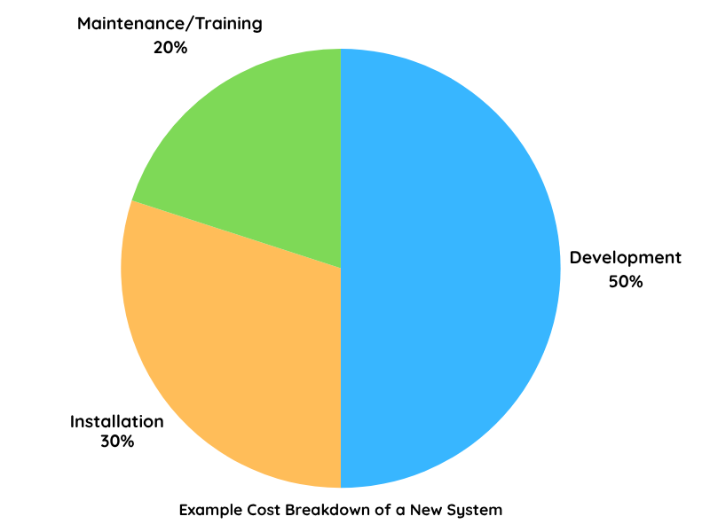
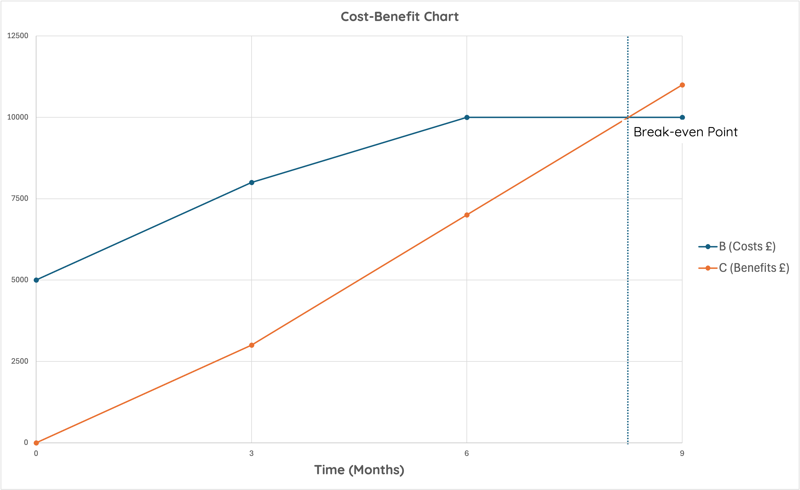

---
hide:
  - toc
---

# Economic Feasibility

!!! info "💷 What is Economic Feasibility?"

    Economic Feasibility deals with the cost implications involved. 
    
    Management will want to know how much each option will cost, what is affordable within the company’s budget and what they get for their money.

    Economic feasibility asks: 
    
    :   __Can we afford this system, and is it worth it?__

    A system is economically feasible if:

    :   * Its __benefits outweigh the costs__

        * It reaches __break-even__ within a realistic timeframe
    
    __Example__:  

    :   A school wants a new timetable system. If the software costs £10,000 but saves £15,000 in admin time over a year, then it’s economically feasible.

## Cost-Benefit Analysis
A cost-benefit-analysis is part of the budgetary feasibility study. 
    
If the project is not cost-effective then there is no point proceeding. Setting up a new computer system is an investment and involves capital outlay. 
    
The costs of a new system include:
    
* the costs of acquiring it in the first place (consultancy fees, program development including cost of any resources required for development, etc.)
    
* the costs of installing it (disruption of current operations, cost of new equipment, alteration of workplace, etc.)
    
* the costs of maintaining it which also includes training. 
<figure markdown="span">
{ width="600" }
</figure>
    
In the long term, management will also want to know the ‘break-even point’ when the new system stops costing money and starts to make money. 

<figure markdown="span">

</figure>

!!! warning "Economic Feasability is Difficult to Estimate"

    It's often difficult to accurately calculate future costs and benefits.

    Estimations depend heavily on the __expertise and experience of the systems analyst__.
	
Once the system begins to generate value, it's important to distinguish the types of benefits it brings. These can be divided into two categories: tangible(__something you can see, touch, or easily quantify__) and intangible(__something that is not easily measured or quantified__).

Benefits generated by a system can be tangible or intangible, as shown below: 

| Tangible Benefits         | Intangible Benefits         |
|--------------------------|-----------------------------|
| Reduced running costs     | Improved staff morale       |
| Increased operational speed| Better customer perception |
| Increased throughput      | Easier communication        |
| Better reporting facilities| Increased job satisfaction |

🚨 Note: __Not all the costs and benefits lend themselves to direct measurement__. 

!!! info "Key Points"
	    
    * The client will want to know the cost of each option and what they get for their money.
		
    *  A system is only economically feasible if the benefits of the development outweigh the costs. For this reason a cost benefit analysis is carried out.

[:octicons-arrow-left-24: Analysis](7.0_index.md){ .md-button }