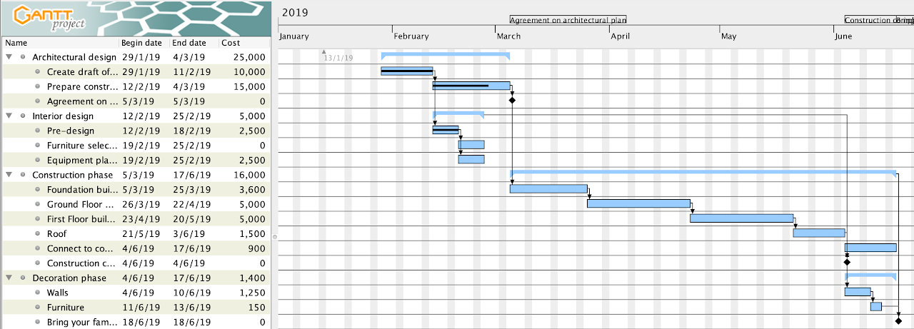
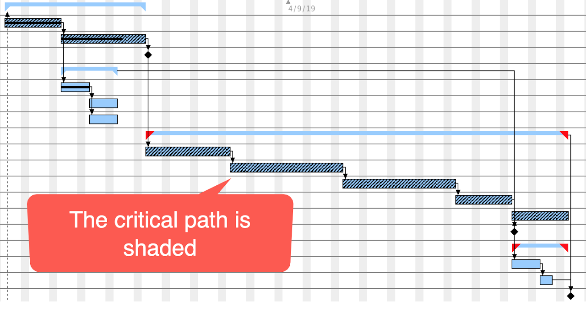
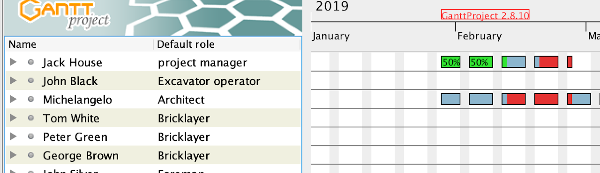

# Project Planning

- :simple-youtube: [**AH Analysis** - Gantt Charts](https://youtu.be/hHprwKs0JJc?si=890LCZedw4m01W_M){:target="_blank"}

## What is in a project plan?

The primary aspects of a project plan are:

1. Tasks/Subtasks
2. Identify Timescales
3. Gantt Chart
4. Identify Budget/Resources

## Tasks and Deadlines

A project should be broken down into an appropriate set of tasks. Tasks should be broken down into sub tasks. Once subtasks are identified timescales and deadlines will have to be assigned - people work more effectively to deadlines.

Advantages of sub tasks:

1. Concurrent processes can be identified,
2. Indication of % complete/tracking progress,
3. Allow identification of the dependency of tasks on the completion of others.
4. Critical Path Analysis
5. Delegation of responsibility for subtasks

## Dependencies

If a task has a relationship with another task then there may be a dependency between the tasks:

==Finish to Start:== Activity A must finish before Activity B can begin

`Example`
> A : Foundations Dug

> B : Concrete Poured

==Finish to Finish:== Activity A must be complete before activity B can finish

`Example`
> A : Last chapter written 

> B (Entire book written)

==Start to Start:== `Activity B` can only start after `Activity A` has started

==Start to Finish:== `Activity B` cannot finish before `Activity A` has finished

`Example`
> A : New shift started

> B Previous Shift finish

## Gantt Charts

Gannt Charts are diagrams used to represent the scheduling of tasks and sub tasks along with start and completion dates. 

An example is shown below:

<figure markdown="span">
{ width="700" }
<figcaption></figcaption>
</figure>

## Critical Path Analysis

Critical path analysis identifies all tasks that must be complete and their minimum time length. 

An extension to any of these tasks would result in the delay of completion of the entire project. 

The sample of the Gantt chart below shows that certain tasks have been pattern shaded as they are in the critical path.

This shows that if any of these tasks take any extra time then that will delay the completion time of the project.

Some of the other tasks will have some slippage time, that is they can run over by some time without the project completion time changing.

<figure markdown="span">
{ width="700" }
<figcaption></figcaption>
</figure>

## Resources and Scheduling

Resources can include access to development tools and end users.

These could be:
* Personnel - particularly those with specific skill sets
* Physical resources/money/software

Some of these could be available at any time, while others may only be available at certain times. 

* You need to plan to ensure that your project is not held up waiting for resources.
* Timings should allow for holidays, or other events that affect how much time you can spend on your project.

The tab below in the Gantt project shows the demand placed on particular resources, in this instance they are personnel but resources could be physical resources such as hardware/rooms.

<figure markdown="span">
{ width="700" }
<figcaption></figcaption>
</figure>