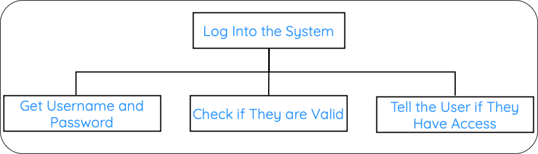
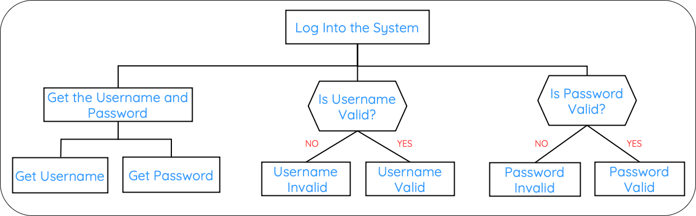
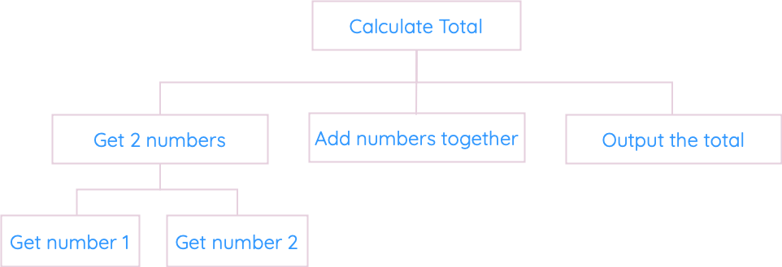
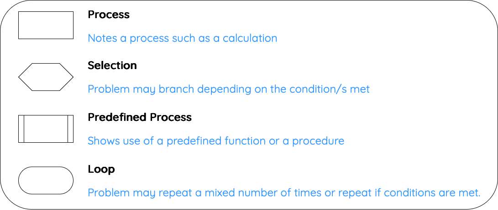
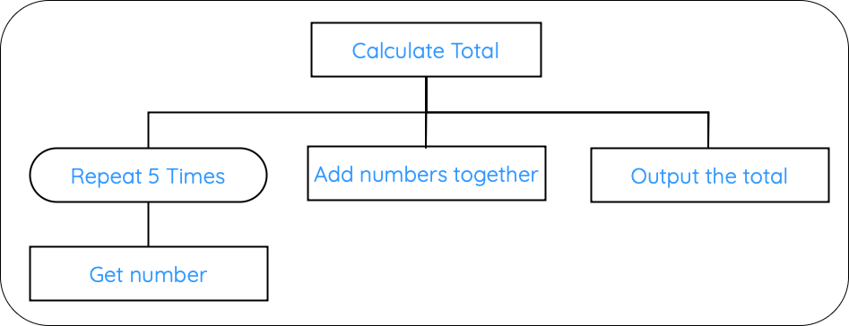
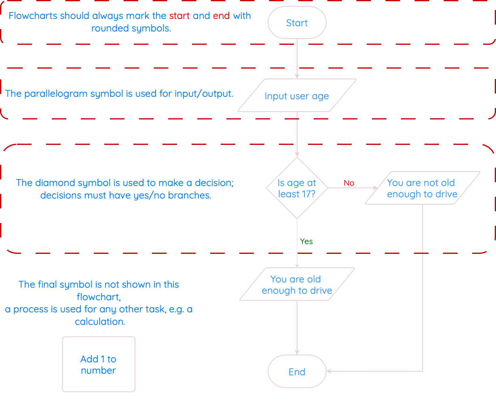

# Design

!!! tip "Quick Links"

    * [Identfying Data Types and Structures](#identifying-data-types-and-structures)
    * [Structure Diagrams](#structure-diagrams)
    * [Flowcharts](#flowcharts)
    * [Pseudocode](#pseudocode)
    * [Wireframe Diagrams](#wireframe-diagrams)

!!! info "What you Need to Know"

    Identify the data types and structures required for a problem that relates to the implementation at this level, as listed below.
    
    Describe, identify, and be able to read and understand:
    
    * structure diagrams
            
    * flowcharts
            
    * pseudocode
    
    Exemplify and implement one of the above design techniques to design efficient solutions to a problem.
    
    Describe, and implement user-interface design, in terms of input and output, using a wireframe.

Efficient problem-solving in computing begins with careful planning and the use of appropriate design techniques to ensure solutions are both effective and easy to implement. 

A key aspect of this process involves identifying the data types and structures required to solve a problem. These choices are critical, as they influence how efficiently a program can handle inputs, process data, and deliver outputs.

To design and understand solutions, several tools and techniques are used:

* Structure diagrams provide a visual breakdown of a system, showing its components and how they interact.

* Flowcharts illustrate the logical flow of processes, making it easier to follow the sequence of steps within an algorithm.
  
* Pseudocode bridges the gap between natural language and programming by offering a simplified, language-agnostic way to represent a solution.

In addition, user-interface design (`wireframes`) are another essential element that usees simple sketches or digital drafts that outline the layout of a user interface, detailing how input and output are managed.

## Variables and Data Structures

At National 5, the two data structures you need to know are:

- **Variable** – stores a single value (e.g. age = 15)
- **Array** – stores multiple values of the same type (e.g. scores = [14, 18, 20])

==You must be able to identify both as data structures in the exam.==

A **variable** is used to **store a single value** during the running of a program. 

``` python linenums="1"
name1 = ("Alice")
name2 = ("Ben")
name3 = ("Carla")
name4 = ("David")
name5 = ("Eilidh")
```

Even though it holds only one value, the SQA considers a **variable** to be a **data structure**, because it is a named place in memory where data is stored.

A data structure is a way to store and organise multiple values. At National 5, the most common structure you will use is an **array** (also called a list).

An array lets you store many values in one place. For example, if you wanted to store the names of five pupils, instead of creating five separate variables, you could use one array:

``` python linenums="1"
names = ["Alice", "Ben", "Carla", "David", "Eilidh"]
```

## Identifying Data Types and Structures

Data types are important when programming. The computer has to know whether to expect numbers, text, or other types of values. 

We could look at the data types in terms of the inputs, processes, and outputs from our analysis.

There are five data types for National 5:
<center>
<table border="1" cellpadding="8" cellspacing="0">
  <thead>
    <tr>
      <th>Data Type</th>
      <th>Used For</th>
    </tr>
  </thead>
  <tbody>
    <tr>
      <td>Integer</td>
      <td>Whole numbers (positive or negative), e.g. 7, -12</td>
    </tr>
    <tr>
      <td>Real</td>
      <td>Numbers with decimal places, e.g. 3.14, -0.5</td>
    </tr>
    <tr>
      <td>Boolean</td>
      <td>True or False values, often used in decisions or conditions</td>
    </tr>
    <tr>
      <td>Character</td>
      <td>A single letter, number, or symbol, e.g. 'A', '3', '?'</td>
    </tr>
    <tr>
      <td>String</td>
      <td>Text made up of multiple characters, e.g. "Hello123!"</td>
    </tr>
  </tbody>
</table>
</center>

==If you are given an example, you need to be able to say which data type it belongs to.==

<center>
<table border="1" cellpadding="8" cellspacing="0">
  <thead>
    <tr>
      <th>Example Value</th>
      <th>Data Type</th>
    </tr>
  </thead>
  <tbody>
    <tr>
      <td>"Ella"</td>
      <td>String</td>
    </tr>
    <tr>
      <td>15</td>
      <td>Integer</td>
    </tr>
    <tr>
      <td>15.5</td>
      <td>Real</td>
    </tr>
    <tr>
      <td>True</td>
      <td>Boolean</td>
    </tr>
  </tbody>
</table>
</center>

!!! example

    > You have been asked to create a program asks the user for the names and ages of everyone in the class.
    > When finished, it displays a message saying how many people are in the class, and their average age.
    
    If you were asked to explain the data types used in this program, in the exam, you would say something like:

    * The `names` are `strings`, because they are `text`
    
    * The `ages` are `integers, e.g. someone is `15` years old
    
    * The number of people in the class is an `integer`, because you can’t have `0.5` of a person
    
    * The average is a `real` number, because it might have a `decimal point` in it.

    The last point is really important - quite often, you could be asked to calculate an average. 
    
    Think about it yourself - if three people are 15, 15 and 16, those are integers - but the average is 15.333, a real number.

    Remeber to fully think through the problems!

==The data types are really important, because we’ll be talking about them all the time during this topic. You’ll be using and discussing these five basic types in every program.==

## Practice

Look at the following scenario and identify the data types:

> A program records whether a pupil has handed in homework, their mark out of 20, and their name.

__What data types would be used?__

## Structure Diagrams

A structure diagram (or structure chart) is the first design notation. 

==We use these to break down the task into smaller chunks==.

The structure diagram is useful for showing the sequence of steps needed to solve the problem. It is always read from top-to-bottom and left-to-right.

??? example "Example 1"

    > You have been asked to create a program that asks for the user’s username and password, checks if they are correct, and tells them whether or not they have been granted access.
    
    * We start with the main task/problem, and put this in the top box.
    
    * We can break the structure diagram into roughly three parts: the `inputs`, the `process` and the `outputs`.
    
    These have to be done in order from left to right:
    
    1. Get the username and password
    2. Check if they are valid
    3. Tell the user if they have access

    <figure markdown="span">
      { width="600" }
    </figure>
    
    However, we can break this diagram down further. 
    
    The first step (get the username and password) can be broken down into two more blocks: 
    
    * get the username
      
    * get the password

    <figure markdown="span">
      { width="600" }
    </figure>
    
??? example "Example 2"

    > You have been asked to create a program that asks for two numbers, calculates the total and displays the total on screen.
    
    * We start with the main task/problem, and put this in the top box.
    
    * We can break the structure diagram into roughly three parts: the `inputs`, the `process` and the `outputs`.
    
    These have to be done in order from left to right:
    
    1. Get the two numbers
    2. Calculate the total
    3. Display the total on screen

    <figure markdown="span">
      { width="600" }
    </figure>

So far, you structure diagrams have used the same symbol (**process, meaning it does something**).

There are four different symbols that can be used on a structure diagram.

<figure markdown="span">
    { width="600" }
</figure>

Look at the example below to see how they can be used.

??? example "Example 3"

    > You have been asked to create a program that asks for five numbers, calculates the total and displays the total on screen.
    
    * We start with the main task/problem, and put this in the top box.
    
    * We can break the structure diagram into roughly three parts: the `inputs`, the `process` and the `outputs`.
    
    These have to be done in order from left to right:
    
    1. Get the five numbers
    2. Calculate the total
    3. Display the total on screen

    <figure markdown="span">
      { width="600" }
    </figure>

## Flowcharts

Flowcharts are used to show the sequence of steps in a program. We read the flowchart from top-to-bottom, following the arrows.

You can use a flowchart with any program, but they are good for clearly showing decisions and loops.

<figure markdown="span">
      { width="800" }
</figure>

    
Flowcharts don’t have a specific symbol for loops. Instead, they have to show a loop as a decision, with the arrows going up/backwards.

In this example, if the password is not correct, the program shows an error message, and then the arrow points back towards asking for the password again. 

This loop will continue until the user enters a correct password, breaking the loop.

<figure markdown="span">
      { width="350" }
</figure>

!!! info

      Some people prefer flowcharts to other notations, and others don’t. 
      
      According to the course spec, you should never be in a position where you have to draw a flowchart from scratch: you usually have a choice of at least two design notations (e.g. a flowchart or a structure diagram). 
      
      ==However, you do need to be able to read and understand a flowchart, and answer questions on one that you are given.==

## Pseudocode

Pseudocode (pronounced sudo-code) is a way of planning your program line-by-line, without writing actual code. 

!!! info "Key Points"

    Pseudocode isn’t as strict as a real programming language. 
    
    We write pseudocode in English. 
    
    There are no fixed rules for how it should look. 

==So long as you break the problem down into steps, and your meaning is clear, you can be awarded the marks.==

You will get more used to seeing pseudocode as you work on practical tasks, as lots of the examples will use it for their design.

The SQA gives the following example of pseudocode to calculate the volume of a swimming pool.

First, we break the problem down into steps:

1. Ask user to enter dimensions of the swimming pool in metres
   
2. Calculate volume of pool (`length * width * depth`)
   
3. Display message stating the volume of the pool

For step 1 (ask the user to enter dimensions), we can break this down further into `1.1`, `1.2` and `1.3`. 

==These are called refinements.== 

Each refined line could later be translated straight into a line of program code.

`1.1` Ask user to enter length

`1.2` Ask user to enter width

`1.3` Ask user to enter height

## Wireframe Diagrams

For software development, all you have to do is sketch a (`rough`) interface based on the inputs and outputs.

The actual programs we create in Python don’t have buttons. However, you can draw a wireframe design with buttons and textboxes if you wish.

In practice, most of your program interfaces will be made up of lines of text:

``` pseudocode linenums="1"
Please enter your name: John
Please enter how many tickets you would like: 5

You have asked for 5 tickets. That will cost £25
```

In this example, there are two inputs (name and number of tickets), and one output (the cost).

All you have to do is draw a (`reasonable`) interface with the right inputs and outputs. 

If you were asked to draw an interface for a calculator program, that asks for two numbers, and multiplies the result, it could be something like:

``` pseudocode linenums="1"
Please enter first number:________
Please enter second number:_______ 

Total multiplied is_______________
```
