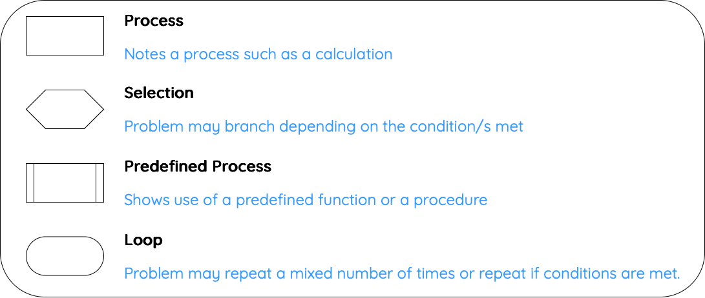

---
hide:
  - toc
---

# Structure Diagrams

!!! info "What you Need to Know"

    __You must be able__ to describe, identify, understand and be able to read:
    
    : * structure diagrams

A structure diagram (also known as a structure chart) is a visual design tool used to break down a problem into smaller, manageable parts. It helps identify the order in which tasks or components must be completed.

A structure diagram is always designed from top-to-bottom and left-to-right:

<figure markdown="span">
{ width="600" }
</figure>

There are four different symbols that can be used on a structure diagram.

<figure markdown="span">
    { width="600" }
</figure>

Using the shapes above we can now break down our __get the username and password__ further by adding: 
    
: * get username
  
: * get password

: * is name valid?

: * is password valid?

<figure markdown="span">
  { width="800" }
</figure>

__Example__

You have been asked to create a program that asks for five numbers, calculates the total and displays the total on screen.

: * We start with the main task/problem, and put this in the top box.

: * We can break the structure diagram into roughly three parts: the __inputs__, the __process__ and the __outputs__.

These have to be done in order from left to right:

1. Get the five numbers
2. Calculate the total
3. Display the total on screen

<figure markdown="span">
  { width="600" }
</figure>

!!! info "Key Points"

    * Structure diagrams are designed top-to-bottom, left-to-right.
    * Each level breaks the problem into smaller parts.
    * They use standard symbols to represent inputs, processes, decisions, and outputs.
    * Diagrams help visualise the overall program structure before coding.

[:octicons-arrow-left-24: Back](5.0_index.md){ .md-button }