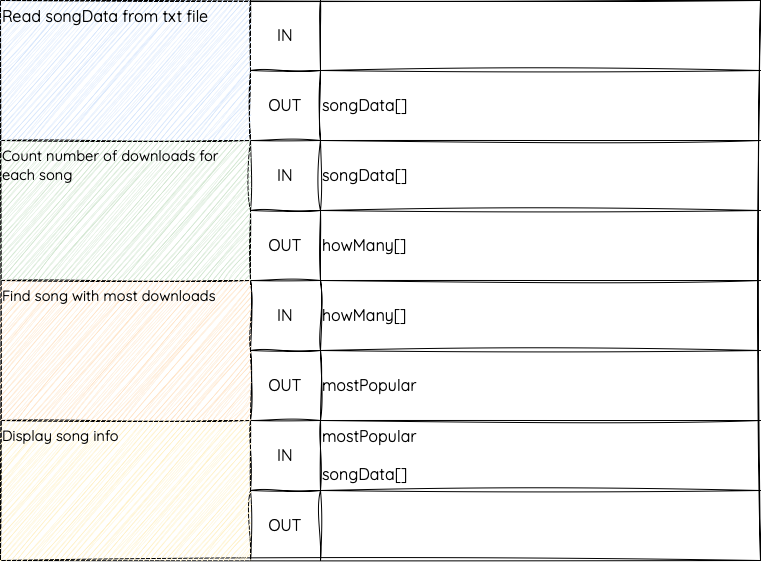

---
hide:
  - toc
---

# Structure Diagrams

!!! info "What You Need to Know"

    __You must be able to__ read, interpret, and implement efficient design solutions to problems, demonstrating the ability to:

    - Create and understand **structure diagrams**
    - Identify and apply **top-level design**
    - Illustrate the **flow of data** between components
    - Use **stepwise refinement** to break down problems into manageable sub-tasks

<iframe width="560" height="315" src="https://www.youtube.com/embed/1Kd9ji1b-nI?si=R6Ne-OpBshpYifjR" title="YouTube video player" frameborder="0" allow="accelerometer; autoplay; clipboard-write; encrypted-media; gyroscope; picture-in-picture; web-share" referrerpolicy="strict-origin-when-cross-origin" allowfullscreen></iframe>

## What is a Structure Diagram?

A structure diagram is a visual tool used during the design stage to break a program into smaller, manageable modules (also called sub-programs). Each module handles a specific task in the overall algorithm.

This is part of a **top-down design** approach, known as **modular programming**. It helps developers:

* Focus on one part of the program at a time
* Reuse and test individual modules
* Work in teams, where each member can be assigned different modules

Top-down design means breaking the problem into successively smaller sub-tasks — each represented as a module.

## Example Structure Diagram

Below is a structure diagram for a program that finds and displays the most-downloaded song on a streaming platform:

<figure markdown="span">
  { width="1200" }
</figure>

Each box represents a module. The box at the top is known as the **top-level design** — it outlines the main steps of the algorithm.

## Data Flow

**Data flow** describes how values are passed between modules. For example:

* Module 1 reads song data → passes it to Module 2

* Module 2 counts downloads → passes results to Module 3

* Module 3 identifies the most popular song → passes details to Module 4

You can show data flow in two ways:

1 - With **arrows** on a structure diagram

<figure markdown="span">
  { width="800" }
</figure>

- Arrows pointing **into** a module show **incoming data**
- Arrows pointing **out** of a module show **outgoing data**

2 - In a **data flow table**

<figure markdown="span">
  { width="450" }
</figure>

!!! warning "Important"

    Input from a user or reading/writing a file is *not* considered data flow.
    Data flow only refers to values passed *between modules*.

## Refinement

Each module in the structure diagram can be broken down using **stepwise refinement** — describing more detailed sub-tasks for implementation.

For example, the module 'Find song with most downloads' could be broken into steps like: set a starting value, compare downloads, and store the result. This level of detail helps when turning the design into code.

<figure markdown="span">
  { width="800" }
</figure>

## Summary

Structure diagrams help you:

* Break a program into logical modules
* Apply a top-down design by identifying the top-level structure and refining it step by step
* Represent the flow of data between modules using arrows or data flow tables
* Prepare for writing refined pseudocode

[:octicons-arrow-left-24: Back](6.0_index.md){ .md-button }
