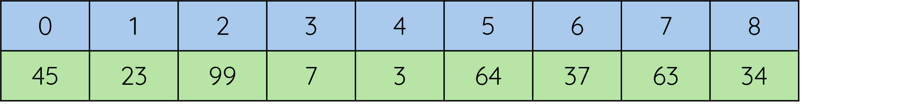
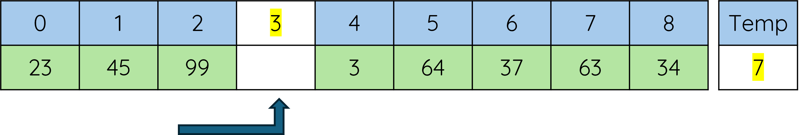

# Insertion Sort

!!! info "What you need to Know"

	Describe, exemplify, and implement insertation sorts
	
	Read and explain code that uses constructs appropriate to this level.

## Explanantion

An insertion sort traverses an array from the second element to the last. 

Each element is compared to the elements before in turn, working backwards down the list.  Values are swapped until the element being compared is placed in order

Consider the following  array

<figure markdown="span">
  { width="800" }
</figure>

### Insertion Sort - Iteration 1

Start with element 1 of the list to be sorted.  __This value is temporarily stored__.

<figure markdown="span">
  { width="800" }
</figure>

If the temp value is smaller than the value before it (element 0), then the value before it, is copied to the right (element 1).

<figure markdown="span">
  { width="800" }
</figure>


Each value, to the left of the element (__where the temp value was originally stored__) is compared until :

* The value being compared is smaller that the stored temp value or 
 
* the start of the list has been reached

When either of the above is true, the temp value is copied back into the list at the previous position.

<figure markdown="span">
  { width="800" }
</figure>

### Insertion Sort - Iteration 2

The next value (__99__) is copied into the temp.

<figure markdown="span">
  { width="800" }
</figure>

When the next value (__99__) is examined, the value before it (__45__) is smaller, __so no further action is required__

<figure markdown="span">
  { width="800" }
</figure>

### Insertion Sort - Iteration 3

The next value (7) is copied into the temp.

<figure markdown="span">
  { width="800" }
</figure>

When the temp value (7) is compared with element 2 (__99__) , it is smaller so __99__ is copied into __element 3__

<figure markdown="span">
  { width="800" }
</figure>

When the temp value (7) is compared with element 1 (__45__), it is smaller so 45 is copied into element 2

## Insertion Sort (1D Arrays)

=== "Python"

    ``` python linenums="1"
    numbers = [7, 2, 5, 3, 4]

    for i in range(1, len(arr)):
		
	current_number = arr[i]
		
	j = i - 1
	
	while j >= 0 and arr[j] > current_number:
  
		arr[j + 1] = arr[j]
   
		j -= 1

		arr[j + 1] = current_number
   
    print("Sorted Numbers:")
	
    print(numbers)
 
    ```

=== "Explanation"

	`Line 1`
	: This line starts the definition of a function called insertion_sort that takes one argument, arr, which will be a list of numbers we want to sort.
	
	`Line 3`
 
	: This loop goes through each item in the list, starting from the second item (i = 1). We don’t need to start from the first item because, by itself, it’s already "sorted."
	
	__current_number = arr[i]__
 
	Here, we store the value of the current item in the list (the one we want to sort into the right place) in a variable called current_number.
	
	__j = i - 1__
 
	We set j to be the index of the item right before current_number. This helps us compare the current_number to the items that are already sorted.
	
	__while j >= 0 and arr[j] > current_number:__
 
	This line starts a loop. It checks if j is still within the list (not less than 0) and if the item at j is bigger than current_number. If both are true, we move the item at j one position to the right. This loop makes space for current_number to be in the right spot.
	
	__arr[j + 1] = arr[j]__
 
	Inside the while loop, this line shifts the number at position j one step to the right (to position j + 1), making room for current_number to move into the correct position.
	
	__j -= 1__
 
	We move j one step to the left to check the next item in the sorted portion of the list. This repeats until current_number finds the correct position.
	
	__arr[j + 1] = current_number__
 
	Once we’ve found the correct spot for current_number, we place it there.
	
	__return arr__
 
	This line gives back the sorted list after we’ve finished the sorting.

## Insertation Sort (2D Arrays)

=== "Python"

    ``` python linenums="1"
	average_temps = [ ["January", "8"],["February", "2"],["March", "22"],["April", "16"],["May", "28"]]
	
	for i in range(1, len(average_temps)):
 
	    key = average_temps[i]
     
	    j = i - 1
	
		while j >= 0 and int(average_temps[j][1]) < int(key[1]):
  
		    average_temps[j + 1] = average_tempss[j]
      
		    j -= 1
      
		    average_temps[j + 1] = key
	 
	print("Sorted Average Temps:")
 
	print(average_temps)
    ```

=== "Explanation"
 
	`Line 1` 
 
 	: This is the list of temps we want to sort from smallest to biggest. 

 	`Line 3`
  
  	: This line tells the computer to look at the list one number at a time, starting from the second number (at position 1, because lists start at position 0). 

  	`Line 4`
   
   	: Here, the computer stores the temp. we’re currently looking at. 
    	  
          __Remember, we start at position 1__.

   	`Line 5`
	: The computer looks at the temp that is before the one we are holding.

	`Line 7`
 
 	: This line is __very important__ as it checks two things:
	
	1. Is there a temp before the current one?

         ``` python
     	     while j >= 0
         ```
	
	2. Is this temp smaller than the current temp? 
	
        ``` python
     	    and int(average_temps[j][1] < key[1]):
        ```
    
	: If both answers are yes, it means the current player should be placed before the one we’re looking at. 

 	`Line 11`
  	
   	: This moves the bigger number to the right.

  	`Line 13`
   
   	: The computer now looks at the next number to the left.
 
 	`Line 13`
  	
   	: Finally, The computer, when we find the right place for our current number, we put it there.
 
## Insertion Sort (Array of Records)

	

