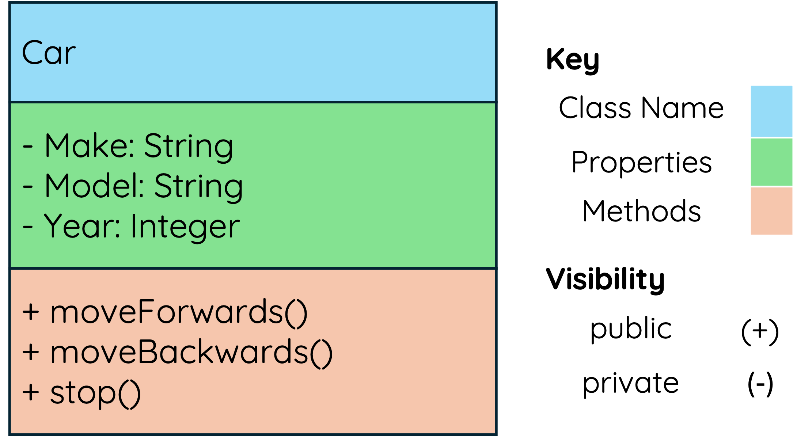
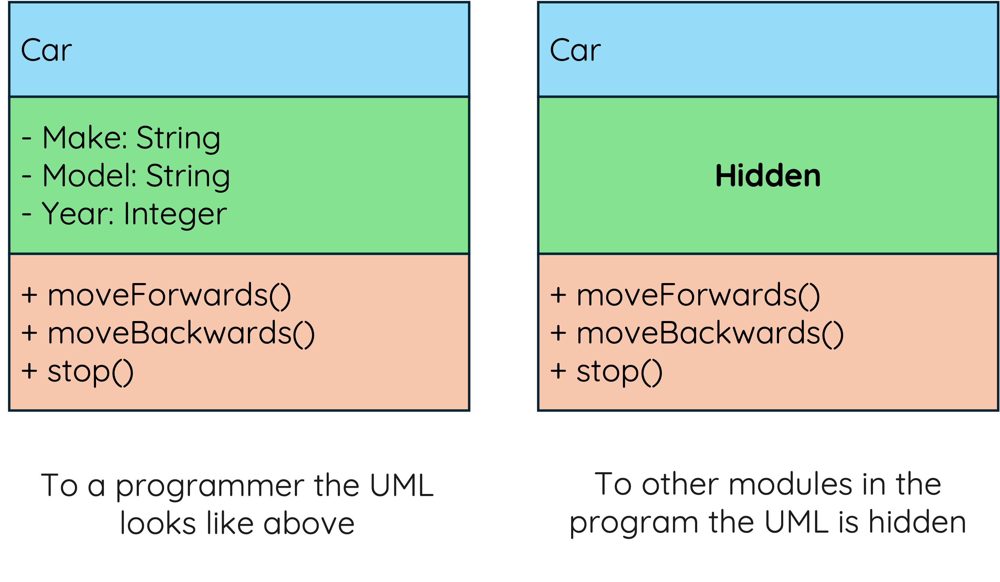

# Object-Oriented Programming

!!! info "What you need to Know"

    Describe, exemplify and implement UML class diagrams:

    * class name
    * instance variables and data types
    * methods
    * public and private
    * inheritance
    * constructor
    * array of objects

## Explanation

In Object-Oriented Programming (OOP), objects are the main building blocks of our program. 

So far we have worked with functions/subroutines that use parameters to pass data around a program. 

We will now be building on our previous knowledge by creating objects that can store data and do things with that data.

## Classes, Objects and Properties

A class is a blueprint for an objects of the same type

Each object has:

* Properties (also called instance variables) — these hold the object’s data.

* Methods — these are the actions or functions the object can perform.

!!! warning "Key Point" 

    **All objects will have the same properties and methods**

??? example "Object Example - Car"

    **Properties**

    * make
    * colour
    * year

    **Methods**

    * Move Forward
    * Move Backwards
    * Stop

    **Think of it like a toy car**:

	* You can look at the box and read the properties (**Ferrari**, **Red**, **2020**).
	
    * Then you can push a button and it does something (**moves forward**, **moves backwards**, **stops**) — those are the methods.

## Instantiation

An object (one cookie) is one instance of a class.

When an object is instantiated it will have:

* its own set of instance variables (properties) 

* have access to all the methods described in the class definition

## UML Class Diagrams

A UML class diagram is the design for a class. 

In the diagram below you can see the defined properties and methods contained within the class. 

<figure markdown="span">
  { width="400" }
</figure>

## Visability

The properties in the class should only be accessible by methods. 

For example:

<figure markdown="span">
  { width="400" }
</figure>

## UML and Python

### The Constructer Method

The Constructor method, shown by **`car()`** in the UML diagram below is a method that is executed when an instance of a given class (object) is created. 

When the program is run, the ** Constructer Method** initialises instance variables using any supplied parameters or the default setup values. 

In short:

* The constructor method initialises the instance variables of the new object

* The constructor method can run only once when a class is created and will run before all other code related to the class

