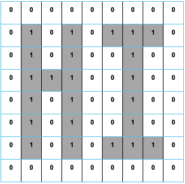

# Representing Data

!!! tip "Quick Links"

    * [Number Representation](#number-representation)
    * [Floating Point Representation](#floating-point-representation)
    * [Storing Characters - ASCII](#storing-characters-ascii)
    * [Storing Graphics](#storing-graphics)

Computer Systems covers all of the super-fast, minute workings, inside devices.  We study the various technological devices and equipment we rely on and use every day through to all-encompassing networks we are ever connected through.

Everything in devices is kept and worked with in Binary numbers, 1s and 0s.  

A single instruction, of the millions of lines of programming running in memory, can take up 64 bits (binary digits) each.  

The multimedia data you use in your programs also range from a few hundred bits for a text file all the way through to billions and billions of bits for a full movie. 

The number of bits required to be processed and stored is mind blowing in our ever-shrinking devices.  It does not seem sensible or simple to us, but Binary is actually very easy to represent in electronics using a high voltage for 1 and a low voltage for 0.  The super speeds of our devices mean they can work with billions of bits per second. 

## Number Representation

We use the Decimal number system to represent the numbers we think about and work with.  Decimal is base 10 meaning we have 10 digits, 0 – 9 (start counting at zero!).  Think about how the positioning of the number can affect its value.

<figure markdown="span">
      { width="800" }
</figure>

Binary numbers also have their own mathematical system which is base 2 (0, 1) and can be used to represent Positive Integer numbers.

<figure markdown="span">
      { width="800" }
</figure>

**Binary to Decimal Conversion**

To convert a Binary number into Decimal we need to remember the conversion table.  

A good way to remember the bit values is that it starts with a 1 over the right most bit and doubles each time.

<figure markdown="span">
      { width="500" }
</figure>  

**Add all the parts that have a 1 above them together to get the Decimal version of the number.**

In the exam you will have to remember the rule on how to write the conversion table above the binary number.  

!!! warning "Note"

      Take time with the basic arithmetic, show your working and re-check your final answer.

**Decimal to Binary Conversion**

The conversion table shows the value of each Bit as their position moves to the left similar to our decimal units/tens/hundreds.

Now that we know the decimal equivalent to the base two system we can use a simple table to help convert a number into binary.

For example, lets convert the number 76 to binary. 

All we need to do is start at the left of the table and see if we can take away the number without going below 0.

1. Can we take 128 away from 76? No. So we put a 0 inside that box.
2. Can we take 64 away from 76? Yes. So we put a 1 in there. We now have 12 left (76-64=12)
3. Can we take 32 away from 12? No. So we put a 0 in there.
4. Can we take 16 away from 12? No. So we put a 0 in there.
5. Can we take 8 away from 12? Yes. So we put a 1 in there. We now have 4 left (12 - 8 = 4)
6. Can we take 4 away from 4? Yes. So we put a 1 in there. We now have 0 left (4 – 4 = 0)
7. As we are now at 0 we fill the remaining boxes in with 0.

<figure markdown="span">
      { width="500" }
</figure>  

**So the number 76 is represented in binary as '01001100'**

**Advantages of Using Binary Numbers**

1. Binary is a simple two-state system (1 or 0) which is ideal when representing a two state system of power on/power off

2. There are only a few rules for addition, making calculations simpler.

3. A degraded signal can still be detected as representing 1.

## Floating Point Representation

Now that we know how to representent positive whole numbers we now have to consider how to represent very large and very small numbers. 

If we used conventional binary methods, then too much memory would be used just to represent numbers.

The technique used to solve this problem is similar to standard form, which you are taught in mathematics, and it is called floating point representation.

In standard form you are taught to write the number `421212.79` as:

<figure markdown="span">
      { width="500" }
</figure>

!!! info 

    The rule is to place the decimal point just after the first digit and to count the number of places that it has been moved. This number is then written as the power. In this case the point was moved five places.
 
Now that we have looked at how floating point representation is used with decimal numbers we now need to understand how it is used with binary. 

When using binary we just follow the same process as binary has a binary point just like a decimal point.

For example, the binary number `1101.001101110010` is written as:

<figure markdown="span">
      { width="800" }
</figure>

Notice that we have **`moved the binary point four places`** but the **`exponent is written as 00000100`**. 

**This is not one hundred; it is the number 4 in binary.**

In the example above we have allocated 2 bytes for the mantissa and 1 byte for the exponent. Computers more commonly allow 4 bytes for the mantissa and at least 1 byte for the exponent.

The computer only needs to store the value of the mantissa and the exponent to represent any real number. 

Computers use floating point is easy to implement and saves storage space.

!!! warning "Remember"

    The exponent is the number of places you have moved the decimal point to the left.

## Storing Characters - ASCII

When you are using a program and you press a key on the keyboard the program has to have some way of identifying which key you pressed. 

This is true for any program whether it is a word processing package, spreadsheet or game. 

Each character on the keyboard has a unique binary code allocated to it.

This is called ASCII. It stands for American Standard Code for Information Interchange. 

ASCII can represent 256 characters. 

ASCII code includes:

* Non-printing characters: <return>, <tab>

* Numbers: 0-9

* Upper and Lower Case Letters: A-Z, a-z

* Punctuation and other symbols: $, %, !, ?, @

All of the above are examples of the character set. 

This is the group of letters and numbers and characters that a computer can represent and manipulate. 

!!! info "Exam Tip"

    In you exam you are highly unlikely to get a question on control characters. You are more likely to recieve a question that: 

    * asks you to provide the leter A in binary. 

    * asks how many letters can be reprsented by extended ASCII (`255`)

    * asks how many bits are used to display "Hello" (`8 bits per letter so "Hello = 5 * 8"`)

    I have added the main symbols/characters below. Try to memorise the decimal number of each sequence, from there you can just continue the sequence.

    === "0-9"

        | Decimal | Binary  | Symbol |
        | ------- | ------- | ------ |
        | 48      | 110000  | 0      |
        | 49      | 110001  | 1      |
        | 50      | 110010  | 2      |
        | 51      | 110011  | 3      |
        | 52      | 110100  | 4      |
        | 53      | 110101  | 5      |
        | 54      | 110110  | 6      |
        | 55      | 110111  | 7      |
        | 56      | 111000  | 8      |
        | 57      | 111001  | 9      |

    === "A-Z (Upper Case)"

        | Decimal | Binary  | Symbol |
        | ------- | ------- | ------ |
        | 65      | 1000001 | A      |
        | 66      | 1000010 | B      |
        | 67      | 1000011 | C      |
        | 68      | 1000100 | D      |
        | 69      | 1000101 | E      |
        | 70      | 1000110 | F      |
        | 71      | 1000111 | G      |
        | 72      | 1001000 | H      |
        | 73      | 1001001 | I      |
        | 74      | 1001010 | J      |
        | 75      | 1001011 | K      |
        | 76      | 1001100 | L      |
        | 77      | 1001101 | M      |
        | 78      | 1001110 | N      |
        | 79      | 1001111 | O      |
        | 80      | 1010000 | P      |
        | 81      | 1010001 | Q      |
        | 82      | 1010010 | R      |
        | 83      | 1010011 | S      |
        | 84      | 1010100 | T      |
        | 85      | 1010101 | U      |
        | 86      | 1010110 | V      |
        | 87      | 1010111 | W      |
        | 88      | 1011000 | X      |
        | 89      | 1011001 | Y      |
        | 90      | 1011010 | Z      |

    === "a-z (Lower Case)"

        | Decimal | Binary  | Symbol |
        | ------- | ------- | ------ |
        | 97      | 1100001 | a      |
        | 98      | 1100010 | b      |
        | 99      | 1100011 | c      |
        | 100     | 1100100 | d      |
        | 101     | 1100101 | e      |
        | 102     | 1100110 | f      |
        | 103     | 1100111 | g      |
        | 104     | 1101000 | h      |
        | 105     | 1101001 | i      |
        | 106     | 1101010 | j      |
        | 107     | 1101011 | k      |
        | 108     | 1101100 | l      |
        | 109     | 1101101 | m      |
        | 110     | 1101110 | n      |
        | 111     | 1101111 | o      |
        | 112     | 1110000 | p      |
        | 113     | 1110001 | q      |
        | 114     | 1110010 | r      |
        | 115     | 1110011 | s      |
        | 116     | 1110100 | t      |
        | 117     | 1110101 | u      |
        | 118     | 1110110 | v      |
        | 119     | 1110111 | w      |
        | 120     | 1111000 | x      |
        | 121     | 1111001 | y      |
        | 122     | 1111010 | z      |

## Storing Graphics

A pixel is the most basic component of any computer graphic. Pixel stands for picture element. 

It corresponds to the smallest element that can be drawn on a computer screen. Every computer graphic is made up of a grid of pixels. When these pixels are painted onto the screen, they form an image.

<figure markdown="span">
      { width="500" }
</figure>

The picture above shows when zoomed into the woman’s eye you can see lots of little blocks. 

**These are pixels.** 

Each pixel stores a separate colour. Today’s cameras take high-resolution photographs that store thousands of pixels, which create a great clear image. 

The above image would be stored as a grid of pixels. Each pixel would also have its own a binary value.

**Storing Black and White Graphics**

<figure markdown="span">
      { width="500" }
</figure>

The above graphic is a really simple black and white image saying “HI”. This image is displayed in a 8 x 8 grid table with each box represents a pixel. 

In black and white, each pixel can be represented by 1 bit: 1 if the pixel is black or 0 if the pixel is white. The computer represents the image in memory as a file of 0s and 1s. 

The computer opens this file then starts looking for numbers that describe image information. Every time it comes to a 0 it draws a white pixel. When it comes to a 1 it draws a black pixel. 

The file is known as a bit map. 

In the 8 x 8 bit-mapped grid above each pixel requires 1 bit of storage. 

There are 64 pixels so this means the image needs 64 bits or 8 bytes of storage (8 bits = 1 byte). 

!!! note

    **Graphics tend to be much larger than this simple example.**

**Storing Vector Graphics**

In a program such as Serif or Photoshop the computer stores information about an object by its attributes i.e., a description of how it is to be drawn.  

For a rectangle these attributes might be x and y position, height, width, thickness and colour of the lines, colour fill etc. 

This means that the rectangle can be selected at any later time and altered by changing its length, dragging it to a new position etc.  

Though the image on the screen is still stored as a bitmap, the drawing package stores the attributes for each object (rectangle, line, circle, ellipse, text etc.) that is drawn. 

When the drawing is saved, only the list of objects and their attributes is stored which greatly reduces the file size.  

When the drawing is loaded the drawing package redraws all the objects.  This means that if you increase the resolution of the screen the object will remain clear and crisp.

**How Vector Graphics are Stored**

The attributes are shown in bold, their values come immediately after the = sign.

<figure markdown="span">
      { width="800" }
</figure>
