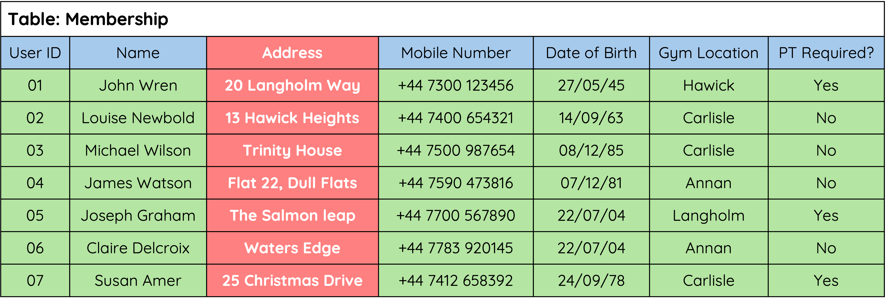
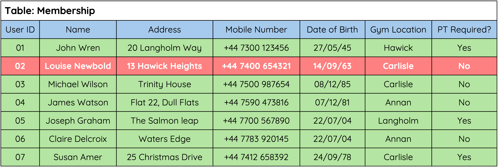
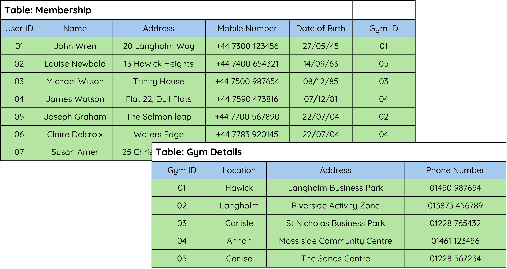

---
hide:
  - toc
---

# Database Structure

## What is a Database?

<iframe width="560" height="315" src="https://www.youtube.com/embed/B64KTbEKDzw?si=mHSt3dsrnWDQ22fd" title="YouTube video player" frameborder="0" allow="accelerometer; autoplay; clipboard-write; encrypted-media; gyroscope; picture-in-picture; web-share" referrerpolicy="strict-origin-when-cross-origin" allowfullscreen></iframe>

A database is an organized collection of information or data. Putting information into a computer database gives you far more flexibility in organising, displaying and printing that information.
Almost everyone who uses a computer will use a database system for something:

* Banks use a database package for storing customers' accounts information
* Your school will use a database package to store information on all the pupils in the school
* Police use databases to keep information on people with criminal records

## Flat File Databases

A flat file database is a database that stores all data in a single table:

* Only one table is used.
* All data is stored in rows and columns within that one table.

{ width="700" }

## Structure of a Flat File Database

__Fields__

A 'Field' holds one piece of data at a time – for example, a person's name, age, or phone number.

{ width="700" }

__Records__

A 'Record' holds all the data for one entry in the table – for example, all the information about a single customer.

{ width="700" }

## Relational Databases

A relational database consists of two or more tables that are linked through relationships (__Primary and Foreign keys__) and the data they store.

__Primary Keys__

A __primary key__ is a field that uniquely identifies each record in a table.
No two records can have the same value in the __primary key field__, and it cannot be left blank.

✅ Example: In the __Membership table__, the __User ID__ could be the __primary key__ because each user must have a __unique ID__.

__Foreign Keys__

A foreign key is a field in one table that links to the __primary key__ in another table.

This relationship connects the data between tables and helps maintain consistency in the database.

✅ Example: Our database has a __Membership table__ and a __Gym Details table__.

* In the __Gym Details__ table, the __Gym ID__ is the __primary key__.

* In the __Membership table__, each member record includes a __Gym ID__ as a __foreign key__ to show which gym the member belongs to.

{ width="700" }

🚨 __Note__

In database design, each `Table` in a relational database represents an __Entity__ — a real-world object like a Customer or Product.

Each `Field` (or column) in the table represents an __Attribute__ — a property of that entity, such as Name or Price.

This difference is important when designing the structure of your database, even though software like Access may still use the terms __*table*__ and __*field*__.

⚠️ __Don’t confuse a record with an entity__. In a flat file database, each record is one instance of an entity (e.g. one customer). In relational databases, the table represents the entity.

!!! info "Advantages of Using a Relational Database"

    * Avoids data duplication.
    * Complex queries can be carried out on multiple tables.
    * Easier to maintain security.
    * Easier to change/update data.

