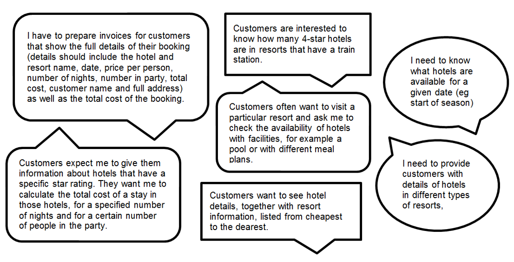

---
hide:
  - toc
---

# Analysis

!!! info "What you need to know"

	You must be able to identify the end-user and functional requirements of a database problem that relates to the implementation at this level. 

When developing a database, it is important to understand exactly what the end-users need the system to do. This involves identifying the end-user requirements as well as the functional requirements. 

For this lesson we will use a travel agency example to help you understand how to gather and define these requirements clearly. 

## End User Requiremnts and Functional Requirements

Before creating a database, we must find out what the people who will use it want it to do. These are called the __end-user requirements__:

* the users are the people who are going to be using the database 
* their requirements are the tasks they expect to be able to do using the database 

We also need to know what the database itself must include and be able to do to meet those needs — these are the __functional requirements__:

* processes and activities that the system has to perform  
* information that the system has to contain to be able to carry out its functions 

During the analysis stage of Database Development, you will need to identify the following requirements:

These requirements help:  

* clarify the design of the database 
* identify the features to be implemented on the database  
* evaluate whether the system is fit for purpose after development is complete

__Example__

A travel agency wants to create a relational database to store details of bookings for hotels in Scottish holiday resorts. 

The database will allow travel agents to view details of hotels and make bookings for customers. 

Four separate entities (tables) are required: 

1.	__Hotel__ (used to store details of hotels in each resort) 
2.	__Resort__ (used to store details of Scottish holiday resorts) 
3.	__Customer__ (used to store details of customers who make holiday bookings) 
4.	__Booking__ (used to store details of hotel bookings) 

They have appointed a developer team to carry out an analysis of the database requirements. 

__The developers ask some of the travel agency staff about the features they would expect to see in the completed database.__

The following are a few of the comments made by the staff: 

<figure markdown="span">
    { width="800" }
</figure>

__End-User Requirements__

Travel agency staff should be able to perform a range of searches to display:
 
* full details of any booking
* availability of hotels in a particular resort, with specified facilities (meal plan or pool)
* details of hotels in a particular type of resort
* details of hotels available for a specified star rating
* resorts that have train stations
 
Staff should be able to sort search results in order of ascending order of price and should be able to calculate:

* the total cost of any holiday booking
* the number of hotels within a certain price range or available on a certain start date

!!! tip "Top Tip"

    Keep the focus on the end user - what do they want to use the database for?

__Functional Requirements__

The relational database will have four tables: 

-   :octicons-database-16:{ .lg .middle } __Hotel__

    ---

    * hotel name (PK)
    * start of season date
    * check-in time
    * price per night
    * meal plan
    * swimming pool
    * star rating

-   :octicons-database-16:{ .lg .middle } __Resort__

    ---

    * resort name (PK)
    * resort type
    * train station

-   :octicons-database-16:{ .lg .middle } __Customer__

    ---

    * Customer ID (PK)
    * first name
    * surname
    * address
    * town
    * postcode

-   :octicons-database-16:{ .lg .middle } __Booking__

    ---

    * Booking ID (PK)
    * start date
    * number in party
    * number of nights

Each table requires a suitable primary key field, with foreign keys linking the four tables.

__Primary Keys__

__Foreign Keys__

In addition, the database must also have the following:

* simple and complex queries to search the database
* a simple sort to order the query results
* a calculation to work out the total cost of a booking
* Calculate the number of 4-star hotels located in resorts that have a train station